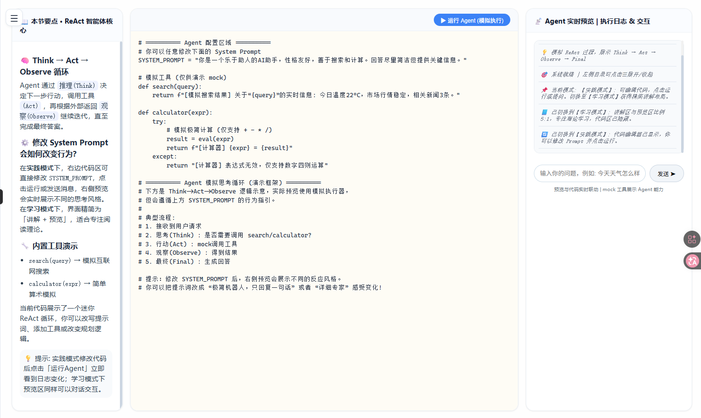

# 1. 设计思路

课程的逻辑是项目导向，按 **“Agent能力递进”** 设计。

整体路径是：

**先理解 Agent的基础知识 → 再无框架跑通最简单的单轮对话 Agent → 在学习过程中不断完善最简单的Agent成为一个完整的有功能的可运行Agent → 再使用框架做规范 Agent**

设计原则：

1. **低门槛进入**
   学生可以直接运行我们写好的最基础Agent，即使coding能力弱也能根据教材指引实现Agent的进化。
2. **先无框架，再框架化**
   无框架阶段帮助学生理解本质，使用框架的阶段帮助学生形成规范实现方式。

# 2. 用户体验

用户体验核心是：

**看得懂，改得动，跑得出，有反馈，能完成。**

不是让学生从零写完整项目，而是平台提供模板、骨架和可修改区域，让学生小步改造。

整体体验可以分成四类：

## 2.1 认知体验

用户先看可以运行平台提供的最基础Agent完成对话，利用体验性降低对未知知识的恐惧，鼓励继续学习。

然后通过结构图理解 Agent 的基本组成，比如输入、Prompt、模型、工具、上下文和输出。

## 2.2 实践体验

用户进入代码案例后，先运行默认版本，看到 Agent 能工作。

然后根据章节要求只修改一个局部，比如增添Prompt，调用Tools，每次实践都是让Agent变得更完善。

核心体验是：

**每章学习后都能看见Agent的进步和变化，感受自己学习的知识落地的成就感**

## 2.3 反馈体验

运行代码在 jupyter notebook里面，可以修改、看报错等

用户遇到问题时，可以问 AI 助手，让 AI 解释代码、报错和修改方式（Ask形式，不是Edit形式直接帮忙修改书写的代码）。

## 2.4 项目体验

跟着平台教程做一个TravelPlanAgent，体验搭建和Agent成长的过程。

# 3. 课程内容
[Agent系统设计与实战开发 课程大纲](大纲.md)
## 主要分为四部分
- 第一部分：与 LLM 协作
- 第二部分：基础Agent构建
- 第三部分：使用成熟Agent框架
- 第四部分：高级Agent开发实战

第一部分能够调用LLM并得到想要的输出，第二部分能够构建一个基础Agent，第三部分能够使用成熟框架构建Agent，第四部分则是一些无法在平台上进行实践的知识介绍。

## 针对无法在平台上实践操作的部分（第四部分）
这一部分不能**只介绍理论和概念**，虽然无法在平台上进行实战，但是也要做到**学练结合**，目前的想法如下：
1. 这一部分也是在TravelPlanAgent的基础上进行进一步开发
2. 每一章先插入视频展示使用后的结果，让学生先有一个清晰的认知和目标
3. 每一章的实战部分则是让学生在本地环境进行练习，平台上则提供练习指导和代码示例，帮助学生在本地环境进行练习。
4. 指导需要尽可能详细，毕竟这一部分的内容无法在平台上进行实践，学生可能会有更多的疑问和困难。配以我们亲自实践的时候的一些截图/指令/踩雷等等

# 4. 平台能力支持

1. 课程内容展示。
2. Agent运行环境（Jupyter Notebook）。
3. AI 问答助手。（待实现）
4. 必要的视频操作插入。(待实现)
5. Agent预览和在线代码修改（待实现）
6. PydanticAI实现的Agent能否在平台上运行（待验证）
7. RAG涉及到的embedding模型，环境等等

前端秉持**三区域**原则

1. 这三部分可以由用户自行调整大小，或者选择只看其中的1-3个板块
2. 代码部分是否可以在前端美化一下，纯文本格式的代码可能不太友好，是否可以做一些高亮或者格式化的处理，让用户更容易阅读和理解。
3. 能否增添函数自动补全功能？

# 总结

当前设计是：

**课程上，先认知，再无框架，再使用框架做Agent。**

**体验上，先看成果，再小步修改，再运行反馈，再完成项目。**

**平台上，先支撑看、改、跑、问、练、交付，不做复杂 IDE 和高级 Agent 系统，不涉及数据库等高级功能。**
