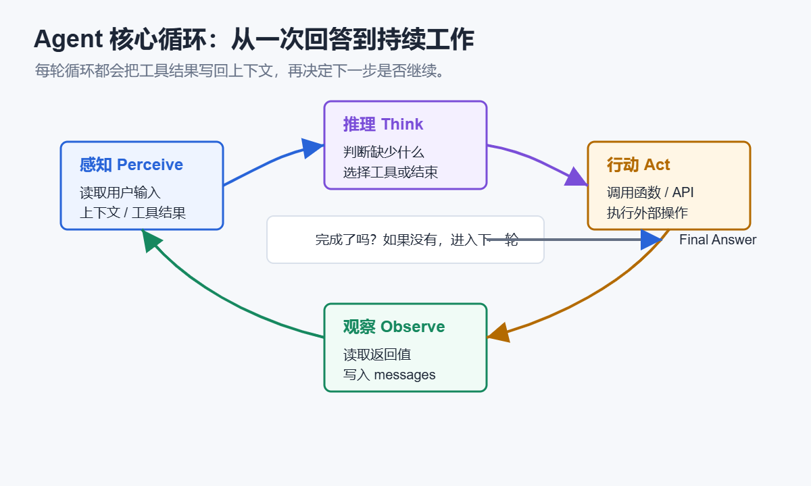
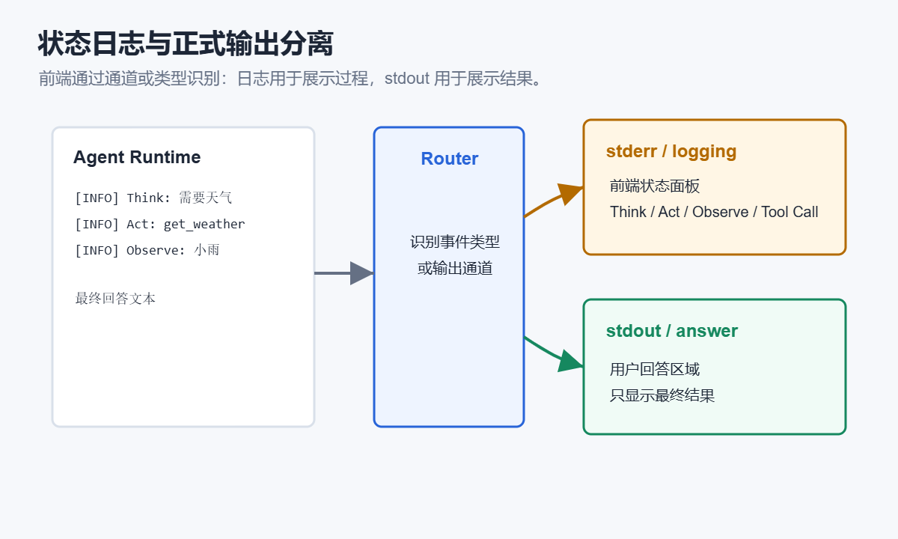

# 第8章 Agent 工作原理：Think-Act-Observe

## 本章摘要

### 新概念

- **Think-Act-Observe**：Agent 先想、再做、再看结果的一轮工作循环。
- **Think**：判断现在缺什么信息，要不要用工具。
- **Act**：真正执行工具调用或其他动作。
- **Observe**：把工具结果放回上下文，让下一次判断有依据。

### 产品功能增量

- 本章会把 TravelPlanAgent 升级到 v0.6。它不再只靠关键词规则选工具，而是让模型参与判断下一步。


## 对 TravelPlanAgent 来说意味着什么

上一章里，TravelPlanAgent 已经能用工具了。不过 v0.5 的工具调用还比较像“程序员提前写好的规则”：

```text
问题里有“天气”，就调用天气工具。
问题里有“攻略”，就调用搜索工具。
问题里有“提醒”，就调用本地小贴士工具。
```

这种方式很好，清楚、稳定，也适合入门。但如果问题稍微复杂一点，关键词规则就会显得笨。

真正更像 Agent 的做法，是让模型参与判断：现在缺什么信息？要不要调用工具？工具结果够不够？还要不要继续查？

第 8 章会把 TravelPlanAgent 升级到 v0.6：

```text
具备 Think-Act-Observe 能力，能够自主选择调用工具
```

Think-Act-Observe 可以先理解成一个工作节奏：先想清楚，再动手做，再看结果。人做事经常也是这样，只是现在我们要把这个节奏写进 Agent 的代码里。


## 本章目标

读完本章，你应该能够理解：

1. Agent 为什么需要工作循环，而不是一次性回答。
2. Think、Act、Observe 分别承担什么职责。
3. Tool Schema 如何让模型知道有哪些工具可以调用。
4. 程序如何执行模型返回的 `tool_calls`。
5. 为什么工具结果要再次放回 messages，让模型继续思考。

## 从一次回答到多轮工作循环

普通 LLM 调用通常是这样：

```text
用户输入
→ 模型回答
```

但 Agent 面对的问题经常不是一次回答就能完成。

比如用户问：

```text
我想周末去杭州玩两天，看看天气，再帮我安排轻松一点的路线。
```

这里至少包含三个需求：

- 识别目的地：杭州；
- 获取天气信息；
- 根据旅行偏好生成路线建议。

如果模型直接回答，它可能会猜天气，也可能漏掉轻松路线的要求。

更可靠的流程是：

```text
Think：这个问题需要天气信息和旅行建议。
Act：调用 get_weather_from_api(city="杭州")。
Observe：杭州当前天气……
Think：天气信息已经足够，还需要结合本地小贴士。
Act：调用 get_local_travel_tips(city="杭州")。
Observe：杭州西湖适合步行和骑行……
Final：基于天气和本地提醒生成两日游建议。
```

这就是 Think-Act-Observe 的价值：**让 Agent 在回答之前先获得必要信息。**

从更通用的 Agent 视角看，Think-Act-Observe 其实对应的是：

```text
感知当前状态 → 推理下一步 → 执行动作 → 观察结果 → 继续循环
```

这也是 Agent 和普通“问一次、答一次”LLM 调用的核心差异。普通 LLM 调用通常只生成文本；Agent 则会在任务完成前不断补充信息、调用工具、修正上下文。

<!-- sbs-image:width=760px -->



下面的交互动画把一次 Agent 工作循环拆成 6 个节点。你可以点击“下一步”，观察状态日志如何记录 Think、Act、Observe，而最终答案仍然只作为正式输出呈现。

```sbs-iframe
src: assets/agent-loop-tao-demo.html
title: Think-Act-Observe 工作循环演示
height: 560px
```

## Think：让模型判断需要什么工具

在 v0.6 中，我们不再只靠关键词规则决定工具，而是把工具列表注册给模型。

模型看到用户问题后，可以返回 `tool_calls`，告诉程序它想调用哪些工具。

工具列表来自每个工具的 Schema：

```python
class BaseTool:
    name: str = "base_tool"
    function_name: str = "run"
    description: str = "基础工具"
    parameters: dict[str, object] = {"type": "object", "properties": {}}

    def to_openai_tool(self) -> dict[str, object]:
        return {
            "type": "function",
            "function": {
                "name": self.function_name,
                "description": self.description,
                "parameters": self.parameters,
            },
        }
```

这段代码的作用是把 Python 工具转换成模型能理解的工具说明。

例如天气工具会告诉模型：

```text
工具名：get_weather_from_api
功能：调用天气 API 获取城市当前天气、气温、湿度、降水和风速
参数：city，字符串，城市名
```

模型并不会直接执行工具。它只是说：

```text
我需要调用 get_weather_from_api，参数是 {"city": "杭州"}。
```

真正执行工具的是我们的 Python 程序。

## Act：执行模型选择的工具

当模型返回 `tool_calls` 后，程序需要解析工具名和参数，然后找到对应的工具类。

v0.6 中的核心逻辑是：

```python
def execute_tool_call(self, tool_call: dict[str, object]) -> ToolResult:
    function_info = tool_call.get("function", {})
    function_name = function_info.get("name", "")
    arguments_text = function_info.get("arguments", "{}")
    arguments = parse_tool_arguments(str(arguments_text))

    tool = self.tool_map.get(function_name)
    if not tool:
        result = ToolResult("unknown_tool", function_name, f"未知工具：{function_name}", False)
    else:
        result = tool.run(arguments)

    logger.info("Observe: %s", result.content)
    return result
```

这段代码体现了一个重要设计：

```text
模型负责选择工具
程序负责执行工具
工具负责返回真实结果
```

这样的边界很重要。模型不能直接访问天气 API，也不能直接搜索网页。它只能提出工具调用请求。

## Observe：把工具结果放回上下文

工具执行之后，Agent 还不能马上结束。

因为模型最初只提出了工具调用请求，并没有看到工具返回值。

所以程序要把工具结果作为 `tool` 消息放回 `messages`：

```python
messages.append(
    {
        "role": "tool",
        "tool_call_id": tool_call.get("id", ""),
        "name": result.function_name,
        "content": result.content,
    }
)
```

这样模型下一轮才能看到：

```text
工具 get_weather_from_api 返回了：杭州当前天气……
```

然后模型可以继续判断：

- 已经足够回答了吗？
- 还需要调用本地小贴士吗？
- 还需要搜索攻略吗？

这就是 Observe 的意义。

## Agent 循环的主流程

v0.6 的主循环集中在 `TravelPlanAgent.run()` 中。

```python
logger.info("Think: 向模型注册三个 Tools，让模型决定调用哪些工具...")

for round_index in range(1, self.max_tool_rounds + 1):
    response = self.llm_client.chat_response(
        messages,
        temperature=0.2,
        tools=[tool.to_openai_tool() for tool in self.tools],
        tool_choice="auto",
    )

    tool_calls = response.get("tool_calls", [])
    if not tool_calls:
        logger.info("Think: 模型没有继续调用工具。")
        final_answer = str(response.get("content", "模型没有返回可用回复。"))
        self.update_memory(user_input, final_answer)
        return final_answer

    for tool_call in tool_calls:
        result = self.execute_tool_call(tool_call)
        messages.append(
            {
                "role": "tool",
                "tool_call_id": tool_call.get("id", ""),
                "name": result.function_name,
                "content": result.content,
            }
        )
```

这个循环最多执行 `max_tool_rounds` 轮，默认是 3 轮。

为什么要限制轮数？

因为 Agent 如果没有限制，可能会不停调用工具，进入无意义循环。

实际开发中，Agent 循环通常都要设置边界：

- 最多工具调用轮数；
- 最长运行时间；
- 最大 token 消耗；
- 遇到错误时是否重试；
- 是否允许调用高成本工具。

v0.6 先使用最简单的 `max_tool_rounds`。

## 状态日志和正式输出分离

这一章的代码还加入了 logging。

Agent 工作状态走 `stderr`：

```text
[INFO] Think: 向模型注册三个 Tools，让模型决定调用哪些工具...
[INFO] Tool Call: get_weather_from_api(city='杭州')
[INFO] Observe: 杭州当前天气……
```

正式回答走 `stdout`：

```text
TravelPlanAgent：根据天气和本地提醒，建议……
```

对前端来说，最重要的是不要只靠文本内容猜测“这是一条日志还是正式回答”。

更稳妥的做法是让运行层明确区分两类信息：

- 状态日志：用于展示 Agent 思考的过程和状态；
- 正式输出：用于展示，进入最终回答区域。

<!-- sbs-image:width=760px -->




## 本章实战

运行后可以输入：

```text
上海天气怎么样？顺便给我一些本地出行提醒。
```

观察日志中是否出现类似内容：

```text
[INFO] Think: 向模型注册三个 Tools，让模型决定调用哪些工具...
[INFO] Tool Call: get_weather_from_api(city='上海')
[INFO] Observe: 上海当前天气……
```

然后观察最终回答是否说明：

- 使用了哪些工具；
- 每个工具做了什么；
- 工具结果如何影响旅行建议。

## 常见问题

### 1. 模型没有调用工具

可能原因：

- 用户问题不够明确；
- Tool description 写得不清楚；
- 模型不支持 tool calling；
- `tool_choice` 没有设置为 `auto`；
- 工具参数 Schema 过于模糊。

可以先用更明确的问题测试：

```text
请调用天气工具查询上海当前天气。
```

### 2. 工具调用了，但参数错了

这通常说明参数说明不够具体。

可以改进 Tool Schema 中的参数描述：

```text
city：中文城市名，例如：北京、上海、杭州、成都、广州。
```

### 3. 工具结果正确，但最终回答没有用上

要检查工具结果是否作为 `role="tool"` 消息放回了 `messages`。

如果只是在终端打印工具结果，模型是看不到的。

## 小结

这一章是 TravelPlanAgent 很重要的一次转弯。

v0.6 不再只是按固定规则调用工具，而是开始有了 Agent 的工作循环：

```text
Think → Act → Observe → Think Again → Final
```

你现在应该能看懂这几个动作：

- Think：判断当前还缺什么；
- Act：执行工具或动作；
- Observe：读取工具结果，并放回上下文；
- Think Again：根据新信息判断是否继续；
- Final：在信息足够时给出最终回答。

下一章我们会继续加一类很常见的能力：RAG。TravelPlanAgent 不只会查实时信息，还能查自己的旅行知识库。
