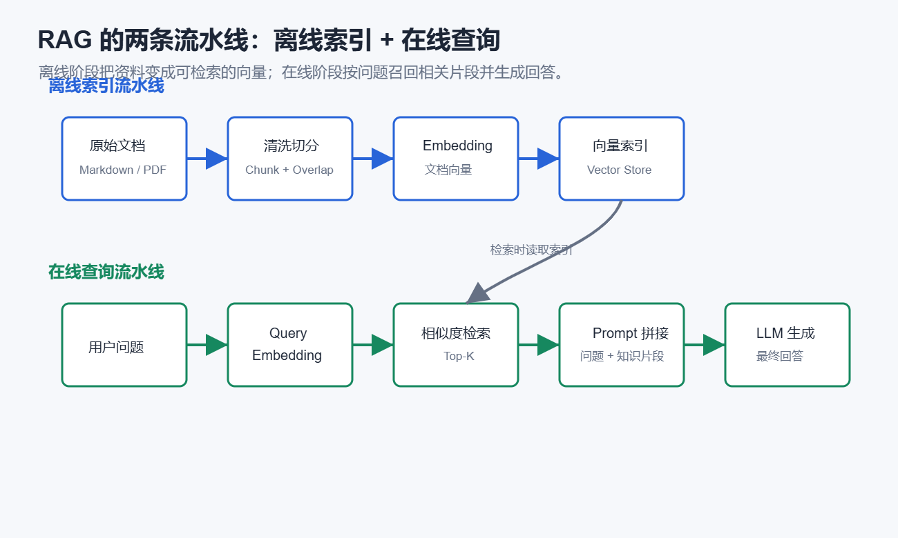
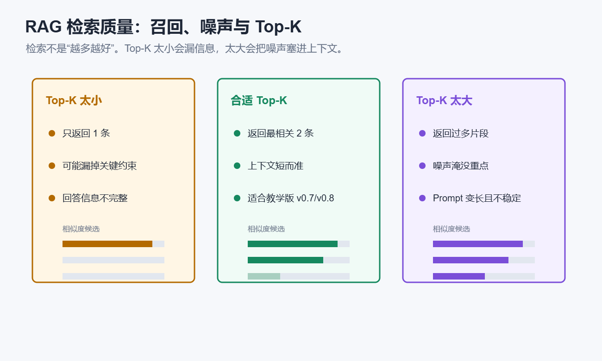

# 第9章 RAG：给 Agent 增加旅游知识检索能力

## 本章摘要

### 新概念

- **RAG**：先从知识库找资料，再让模型带着资料回答。
- **Chunk**：把长文档切成小片段，方便检索。
- **Embedding**：把文字变成向量，让程序能比较语义相似度。
- **Top-K 检索**：只拿最相关的前几条，别把一堆无关材料塞给模型。

### 产品功能增量

- 本章会把 TravelPlanAgent 升级到 v0.7。它能查自己的旅行知识库，回答时多一份可追溯的依据。


## 对 TravelPlanAgent 来说意味着什么

v0.6 的 TravelPlanAgent 已经能自己判断要不要调用工具。接下来我们会遇到另一类问题：有些知识不适合每次都靠搜索，也不适合一股脑塞进 Prompt。

比如课程里已经整理了一批相对稳定的旅游知识：

- 上海经典城市路线；
- 北京历史文化路线；
- 杭州西湖与茶文化；
- 成都慢旅行与美食；
- 广州美食与城市文化；
- 通用旅行规划原则。

这些内容不像天气那样每小时变化，也不像用户偏好那样只属于某一次对话。它们适合放进一个本地知识库，需要时再查出来。

第 9 章会把 TravelPlanAgent 升级到 v0.7：

```text
具备旅游知识检索能力，可以从本地知识库中找到相关片段，再基于片段回答
```

这就是 RAG。你可以先把它理解成“先翻资料，再回答问题”。区别在于，翻资料这件事由程序完成，回答问题这件事交给模型完成。


## 本章目标

读完本章，你应该能够理解：

1. 为什么 Agent 需要 RAG。
2. 什么是知识库、Chunk、Embedding 和相似度。
3. 如何把用户问题转换成向量。
4. 如何用向量相似度找到最相关知识片段。
5. 如何把检索结果作为工具结果放回 Agent。
6. RAG 常见问题包括召回失败、噪声和上下文过长。

## 为什么需要 RAG

LLM 的知识来自训练数据，但训练数据不一定：

- 足够新；
- 足够贴近你的需求；
- 足够稳定可控。

比如用户问：

```text
杭州雨天怎么玩？我不想安排太累。
```

模型可能会回答一些合理建议，但它不一定知道我们课程知识库中已经写过：

```text
雨天可以安排南宋德寿宫遗址博物馆、浙江省博物馆、河坊街和室内茶馆。
```

RAG 的思路是：

```text
用户问题
→ 从知识库检索相关片段
→ 把片段放入上下文
→ 模型基于片段生成回答
```

这样模型回答时就有了可参考的依据。

## RAG 的基本流程

RAG 不是简单地往 Prompt 里塞更多资料。它会把知识使用拆成两条流水线：

- 离线索引流水线：提前处理文档，切分成 chunk，生成 embedding，并保存到可检索的索引中；
- 在线查询流水线：用户提问时生成 query embedding，检索最相关片段，再把片段放入 Prompt 或 Observation。

<!-- sbs-image:width=820px -->



一个最小 RAG 在线流程通常包含 5 步：

```text
1. 准备知识库
2. 把知识库切成 chunks
3. 为每个 chunk 生成 embedding
4. 为用户问题生成 embedding
5. 根据相似度找出最相关 chunks
```

然后把检索结果放回 Prompt 或工具 Observation。

在 TravelPlanAgent v0.7 中，RAG 被做成一个 Tool：

```text
rag_search_travel_knowledge
```

这意味着 RAG 不再是单独运行的脚本，而是 Agent 可以自主选择的工具。

和普通 RAG 相比，RAG + Agent 的关键差异在于：检索不是固定发生在每次请求开头，而是由 Agent 根据任务状态决定是否检索、检索什么、检索结果是否足够。

例如用户只问：

```text
你好
```

就不需要检索旅游知识库。

但如果用户问：

```text
杭州下雨天怎么玩？我不想安排太紧。
```

Agent 就应该主动调用 `rag_search_travel_knowledge`，把“杭州雨天”和“轻松行程”相关片段取出来，再生成回答。

下面的动画演示了 TravelPlanAgent v0.7/v0.8 中的 RAG 过程：先生成问题向量，再计算相似度，最后只把最相关的前两条知识片段写入 Observation。

```sbs-iframe
src: assets/rag-retrieval-demo.html
title: RAG 检索与相似度排序演示
height: 620px
```

## 什么是 Chunk

知识库通常不会整篇直接拿去检索，而会先切成多个小片段。

这些片段叫 chunk。

例如：

```text
# 杭州西湖与茶文化
杭州适合慢节奏旅行。西湖可以安排断桥、白堤、苏堤……
```

可以作为一个 chunk。

再比如：

```text
# 通用旅行规划原则
旅行规划时，每天不要安排过多景点……
```

也可以作为一个 chunk。

chunk 太大，检索结果会不够精确。

chunk 太小，单个片段可能缺少上下文。

实际项目中常见的切分策略包括：

| 切分方式 | 适合场景 | 优点 | 风险 |
| --- | --- | --- | --- |
| 固定长度切分 | 普通长文本 | 实现简单 | 可能切断语义 |
| 按段落切分 | Markdown、课程文档 | 保留自然语义 | 段落长短不均 |
| 递归字符切分 | 结构化文本 | 优先按标题、段落、句子切 | 参数需要调试 |
| 父子文档检索 | 长文档问答 | 小块精确召回，大块保留上下文 | 实现更复杂 |

本章为了教学清晰，先按段落切分。这样学生可以直接看到“知识库文本 → chunk 列表 → embedding 列表”的关系：

```python
def build_index(self):
    if self.chunks is not None and self.embeddings is not None:
        return self.chunks, self.embeddings

    self.chunks = [
        chunk.strip()
        for chunk in self.knowledge_text.strip().split("\n\n")
        if chunk.strip()
    ]
    self.embeddings = self.embed_texts(self.chunks)
    return self.chunks, self.embeddings
```

还有一个容易被忽略的参数是 Top-K。

Top-K 表示最终给 LLM 的候选片段数量。它不是越大越好：太小会漏掉必要信息，太大会把低相关内容和噪声一起塞进上下文。

<!-- sbs-image:width=820px -->



在 TravelPlanAgent v0.7/v0.8 中，我们为了让教学结果清楚可控，只保留最相关的前两条：

```text
Top-K = 2
```

这不是说真实项目永远只取 2 条，而是为了让本章先聚焦“检索、排序、回填 Observation”这条主线。等知识库变大后，可以再引入 query rewriting、hybrid search、reranking 等进阶方法。

## 什么是 Embedding

Embedding 是把文本变成数字向量（通常是 768 或 1536 维的浮点数数组）

语义相近的文本，向量也会更接近。

例如：

```text
杭州雨天怎么玩
```

应该和下面这段知识更接近：

```text
雨天可以安排博物馆、展览、茶馆和餐饮体验。
```

而不是和：

```text
广州早茶适合安排在上午。
```

在本章中，我们使用 `BAAI/bge-m3` 生成 embedding。


## 在 v0.7 中实现 RAG Tool

v0.7 中的 RAG 工具叫 `RagKnowledgeTool`。

它和其他工具一样继承 `BaseTool`。


```python
class RagKnowledgeTool(BaseTool):
    name = "rag_search"
    function_name = "rag_search_travel_knowledge"
    description = "使用 bge-m3 embedding 模型检索课程内置旅游知识库，返回最相关的知识片段。"

    def __init__(self, knowledge_text: str = TRAVEL_KNOWLEDGE, model_name: str = "BAAI/bge-m3") -> None:
        self.knowledge_text = knowledge_text
        self.model_name = model_name
        self.embedding_model = None
        self.chunks = None
        self.embeddings = None
```

这里有两个重要点：

1. `model_name` 默认是 `"BAAI/bge-m3"`；
2. `embedding_model` 初始为 `None`，真正检索时才加载模型。

这种方式叫懒加载。

它可以避免程序一启动就加载大模型。

## 加载 embedding 模型

加载方式和最小调试代码一致：


```python
def load_embedding_model(self):
    if self.embedding_model is not None:
        return self.embedding_model

    from sentence_transformers import SentenceTransformer

    self.embedding_model = SentenceTransformer(self.model_name)
    return self.embedding_model
```

其中：

```python
self.model_name = "BAAI/bge-m3"
```

所以等价于：

```python
SentenceTransformer("BAAI/bge-m3")
```

## 生成 embedding

我们给文本列表生成向量：

<!-- sbs-code -->

```python
def embed_texts(self, texts: list[str]):
    model = self.load_embedding_model()
    embeddings = model.encode(
        texts,
        batch_size=8,
        normalize_embeddings=True,
        show_progress_bar=False,
    )
    return np.asarray(embeddings, dtype=np.float32)
```

这里比最小调试代码多了几个参数：

| 参数 | 作用 |
| --- | --- |
| `batch_size=8` | 一批处理多个文本 |
| `normalize_embeddings=True` | 把向量归一化，方便用点积比较相似度 |
| `show_progress_bar=False` | 不显示进度条，避免干扰日志输出 |

## 计算相似度

当知识库 chunks 和用户问题都变成向量后，就可以计算相似度。

v0.7 中使用点积：


```python
scores = chunk_embeddings @ query_embedding
ranked_indices = np.argsort(scores)[::-1][:top_k]
```

含义是：

```text
chunk_embeddings @ query_embedding
```

计算每个知识片段和用户问题的相似度。

```text
np.argsort(scores)[::-1]
```

按照相似度从高到低排序。

```text
[:top_k]
```

只取前几条最相关结果。

## 把 RAG 做成 Agent Tool

RAG 最终会返回一段文本：

```text
RAG 检索工具：rag_search_travel_knowledge
检索问题：杭州雨天怎么玩
最相关知识片段：
1. 相似度：0.8123
# 杭州西湖与茶文化
……
```

这段文本会作为 Tool Observation 放回 `messages`。

模型最终回答时就能引用这些知识。

这一步非常关键：

```text
RAG 不是直接替模型回答。
RAG 负责找资料。
模型负责根据资料组织回答。
```

## 本章实战

运行前建议先测试 embedding 环境：

<!-- sbs-code -->

```python
from sentence_transformers import SentenceTransformer

model = SentenceTransformer("BAAI/bge-m3")
embedding = model.encode("杭州雨天怎么玩")

print(len(embedding))
```

如果可以输出向量长度，再运行 TravelPlanAgent v0.7。

可以输入：

```text
杭州雨天怎么玩？我想轻松一点。
```

观察日志中是否出现：

```text
[INFO] Tool Call: rag_search_travel_knowledge(query='杭州雨天怎么玩？我想轻松一点。', top_k=...)
[INFO] Observe: RAG 检索工具……
```

然后检查最终回答是否真的使用了检索片段，而不是泛泛而谈。

## 常见问题

### 1. 模型下载失败

如果第一次运行：

```python
SentenceTransformer("BAAI/bge-m3")
```

失败，通常是模型下载或网络环境问题。

可以先单独运行最小调试代码，确认模型能加载，再运行完整 Agent。

### 2. 检索结果不相关

可能原因：

- chunk 切分太粗；
- 用户问题太短；
- 知识库内容太少；
- top_k 太小；
- embedding 模型不适合当前语言或任务。

调试时可以打印：

```text
检索问题
相似度
返回片段
```

不要只看最终回答。

### 3. 检索结果正确，但回答没有引用

要检查 RAG 结果是否作为工具消息回填到 `messages`。

如果只是打印在终端，模型看不到。

### 4. RAG 不是搜索引擎

RAG 检索的是你提供的知识库。

如果知识库里没有某个信息，RAG 不会凭空找到。

比如知识库中没有“某景点今天是否闭馆”，那就应该调用搜索工具或提醒用户核验。

## 小结

到这里，TravelPlanAgent 已经升级到 v0.7，能先翻资料，再回答问题。

RAG 这条线可以先记成四步：

```text
切分资料 → 生成向量 → 找相似片段 → 放回上下文
```

你已经见过：

- chunk 是知识库的检索单位；
- embedding 把文本变成向量；
- 相似度帮助我们找出相关片段；
- Top-K 控制拿回多少资料；
- RAG 最适合作为 Tool 接入 Agent 循环；
- 检索结果要作为 Observation 放回上下文。

下一章任务会更大：TravelPlanAgent 不只要查资料，还要把完整旅行规划拆开，交给多个子 Agent 协作完成。
