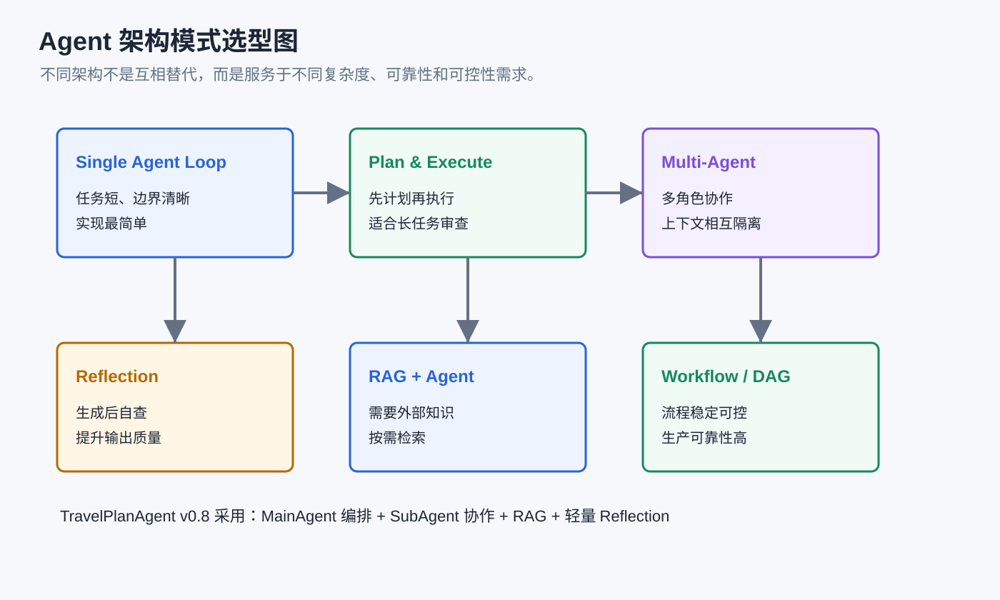
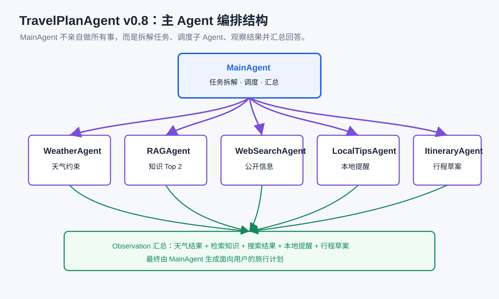

# 第10章 Agent 架构模式：从工具调用到任务规划

## 本章摘要

### 新概念

- **架构模式**：把 Agent 的能力组织起来，避免复杂任务变成一锅粥。
- **Plan & Execute**：先拆出计划，再按步骤执行。
- **Multi-Agent**：让不同子 Agent 分别负责天气、检索、路线等事情。
- **Reflection**：让 Agent 回头检查自己的结果，看看有没有漏掉或不合理的地方。

### 产品功能增量

- 本章会把 TravelPlanAgent 升级到 v0.8。它能拆解完整旅行规划任务，调度多个子 Agent，并检查行程是否合理。


## 对 TravelPlanAgent 来说意味着什么

到第 9 章，TravelPlanAgent 已经有了不少能力：能调用 LLM，能维护上下文，能使用工具，能做 RAG，也能走 Think-Act-Observe 循环。

如果用户只是问“上海明天天气怎么样”，这些能力已经够用了。但完整旅行规划通常不是一个小动作。

比如：

```text
我想去成都玩三天，想看熊猫、吃美食，行程不要太累，帮我安排一下。
```

这里面至少有几件事要做：理解目的地和偏好，查天气，检索旅游知识，必要时搜索公开攻略，生成行程草案，再检查每天是不是太满。

如果把所有事情都塞给一个大函数，代码会越来越难读。第 10 章会把 TravelPlanAgent 升级到 v0.8：

```text
一个具备完整功能的旅行规划 Agent
```

这一章的重点从“再加一个工具”转向“怎样组织工具和子任务”。等任务变复杂以后，架构本身就会变成一种能力。


## 本章目标

读完本章，你应该能够理解：

1. 为什么复杂任务需要架构模式。
2. Plan & Execute、Reflection、Multi-Agent、Workflow/DAG 分别解决什么问题。
3. 主 Agent 和子 Agent 如何分工。
4. `SubAgentResult` 为什么能统一子 Agent 输出。
5. v0.8 如何从用户需求拆解子任务、执行任务、观察结果并生成最终回答。
6. 为什么最终回答不应该暴露过多内部协作细节。

## 为什么需要架构模式

早期 Agent 代码通常是线性的：

```text
用户输入
→ 调用模型
→ 调用工具
→ 回答用户
```

随着能力增加，代码会遇到三个问题。

第一个问题是职责混乱。

一个函数既判断用户意图，又调用天气，又做 RAG，又生成行程，后面很难维护。

第二个问题是任务复杂。

一次完整旅行规划，往往要连续完成一组动作。

第三个问题是结果需要检查。

Agent 可能安排太多景点，也可能忘记用户说“不想太累”。

因此，我们需要更清晰的架构模式。

## 常见 Agent 架构模式

Agent 架构可以理解为：如何组织“感知、推理、行动、观察”这个基本循环。

不同架构解决的问题不同。一个简单问答不需要 Multi-Agent；一个跨多个信息源的旅行规划，也不适合全部塞进单个函数。

<!-- sbs-image:width=840px -->



下面几种模式在实际项目中经常组合使用。

### Single Agent Loop

Single Agent Loop 是最基础的架构：一个 Agent 接收任务、读取上下文、选择工具、观察结果，再决定是否继续下一轮。

它对应的是 Agent 最核心的工作方式：

```text
Perceive → Reason → Act → Observe → Repeat
```

也可以理解为 ReAct 思路的简化形态：Reasoning 负责思考，Acting 负责调用工具，Observation 再把工具结果带回上下文。

在这种架构里，LLM 像“大脑”，工具像“手”，上下文窗口像“工作台”。所有中间结果都会放在同一个工作台上，下一轮推理继续使用这些信息。

它适合边界清晰、轮次较少的任务，例如：

```text
查询杭州天气，并给出一句出行建议。
```

它的优点是：

- 实现最简单，学生容易理解；
- 调试链路短，问题通常出在 Prompt、工具参数或工具返回值；
- 很适合 v0.6 这样的 Think-Act-Observe 教学版本。

它的缺点也很明显：

- 所有信息都堆在同一个上下文里，复杂任务容易撑满上下文窗口；
- 任务一长，Agent 可能忘记最初目标；
- 不适合并行处理多个相对独立的子任务。

所以在 TravelPlanAgent 中，Single Agent Loop 适合回答“查一下成都天气”“给我一个上海美食建议”这类短任务；但如果用户要求完整三日游计划，就需要更清晰的任务组织方式。

### Plan & Execute

Plan & Execute 可以理解为：

```text
先制定计划，再逐步执行
```

它的核心思想是把“想清楚要做什么”和“真正执行动作”分开。

在规划阶段，模型不调用工具，只输出一个可检查的步骤列表；在执行阶段，程序或 Agent 再按步骤调用工具、收集结果、生成答案。

例如用户说：

```text
帮我安排杭州两日游，适合雨天。
```

Agent 可以先拆解任务：

```text
1. 查询杭州天气
2. 检索杭州雨天旅行知识
3. 生成两日路线
4. 检查路线是否太满
```

再逐步执行这些任务。

这种架构的优势是可审查。执行前先看到计划，用户或程序都能判断步骤是否合理。对于课程来说，它也能帮助学生把复杂任务拆成更小的动作。

Plan & Execute 还可以分成两种变体：


| 变体     | 特点                               | 适合场景                         |
| -------- | ---------------------------------- | -------------------------------- |
| 静态规划 | 先生成一次计划，然后按计划执行到底 | 流程稳定、意外较少的任务         |
| 动态规划 | 每执行几步后重新评估计划           | 信息不确定、执行中可能变化的任务 |

旅行规划更接近动态规划。比如先查天气后发现目的地有雨，后续路线就需要调整；如果用户说“不想太累”，执行中还要检查景点密度是否过高。

它的代价是：

- 简单任务会多一次规划调用；
- 初始计划可能不准确；
- 动态重规划会增加 token 成本和延迟。

因此，在 TravelPlanAgent v0.8 中，我们没有把所有请求都强制走 Plan & Execute，而是先判断用户是否真的需要完整规划。

### Multi-Agent

Multi-Agent 是把不同职责分给不同 Agent。

Multi-Agent 的重点不在“Agent 越多越高级”，而在通过角色拆分降低复杂度。主 Agent 负责理解目标、拆解任务、调度子 Agent、汇总结果；子 Agent 负责完成某一类稳定职责。

在 v0.8 中，我们设计了几个子 Agent：


| 子 Agent         | 职责                 |
| ---------------- | -------------------- |
| `LocalTipsAgent` | 读取本地出行提醒     |
| `WeatherAgent`   | 查询天气 API         |
| `RAGAgent`       | 检索旅游知识库       |
| `WebSearchAgent` | 搜索公开网页攻略     |
| `ItineraryAgent` | 综合结果生成行程草案 |

主 Agent 不亲自完成所有事情。

它负责：

- 判断是否需要子 Agent；
- 拆解任务；
- 调度子 Agent；
- 观察结果；
- 决定是否补充调用；
- 汇总最终回答。

Multi-Agent 的理论价值主要体现在三点。

第一是职责隔离。每个子 Agent 可以有自己的角色、工具和上下文，天气查询不会污染 RAG 检索，行程生成也不需要知道天气 API 的调用细节。

第二是上下文隔离。复杂任务中，不同子任务会产生大量中间信息。如果全部塞进一个 Agent，很容易把上下文弄得又长又乱。子 Agent 完成任务后，只把精简的 observation 返回给主 Agent，可以降低主上下文压力。

第三是可扩展性。后续如果要新增 `BudgetAgent`、`HotelAgent` 或 `TrafficAgent`，主 Agent 只需要学会什么时候调度它们，而不是把所有逻辑塞进一个巨大函数。

它的代价是编排更复杂：

- 主 Agent 需要决定调度哪些子 Agent；
- 子任务之间可能存在依赖顺序；
- 某个子 Agent 失败时，需要有降级策略；
- 多个 observation 可能冲突，需要主 Agent 做取舍。

所以 Multi-Agent 不适合为了形式而使用。只有当任务确实包含多个相对独立的能力模块时，它才有明显收益。

### Reflection

Reflection 可以理解为自我检查。

它关注的重点是“如何让输出更可靠”，而不只是执行更多工具。

很多 Agent 出问题，并不是缺工具，而是缺少检查：

- 忘记用户约束；
- 生成内容格式不一致；
- 推理链条中某一步用了错误信息；
- 最终答案看起来完整，但其实漏掉关键条件。

在旅行规划中，常见检查包括：

- 行程是否太满；
- 是否符合天气；
- 是否符合用户偏好；
- 是否遗漏交通和预约提醒；
- 是否需要补充搜索最新信息。

v0.8 中的 `observe_and_decide_next()` 就是一种轻量 Reflection。

它会观察已有结果，再判断是否需要补充调用其他子 Agent。

Reflection 不一定要写成很重的“反思 Agent”。在教学版本里，它可以先表现为几个明确检查：

```text
已有 observation 是否足够？
是否缺少天气、知识或行程草案？
最终安排是否违背用户偏好？
```

这样既能体现自我检查，又不会让代码过早变复杂。

在更完整的系统里，Reflection 常见有两种实现方式：


| 实现方式    | 做法                             | 优点               | 风险                     |
| ----------- | -------------------------------- | ------------------ | ------------------------ |
| 自我反思    | 同一个模型生成后再检查自己的输出 | 实现简单，成本较低 | 可能看不出自己的错误     |
| Critic 模型 | 另一个模型或规则模块专门评估输出 | 更客观，质量更稳定 | 增加调用成本和系统复杂度 |

对 TravelPlanAgent 来说，当前阶段最适合的是轻量 Reflection：检查 observation 是否足够、是否缺少关键子任务、最终计划是否违背用户偏好。

### RAG + Agent

RAG + Agent 是把检索能力作为 Agent 可以主动选择的工具。

RAG 解决的是 Agent 的知识来源问题。LLM 自身的训练知识不一定新、不一定符合课程项目，也不一定包含我们的本地旅游知识库。

如果把所有知识都写进 Prompt，会浪费上下文；如果完全依赖模型记忆，又不可控。因此 RAG 会先检索相关片段，再让模型基于片段回答。

普通 RAG 往往是固定流程：

```text
用户提问 → 检索一次 → 生成回答
```

RAG + Agent 则更灵活：

```text
Agent 判断需要知识 → 检索 → 观察结果 → 必要时继续检索或调度其他工具
```

在 TravelPlanAgent v0.8 中，`RAGAgent` 就承担这个角色。它不是替代天气 API 或搜索工具，而是补充稳定的课程内置旅游知识。

这里要注意三种信息来源的区别：


| 信息来源        | 适合内容                 | 在 v0.8 中的角色                 |
| --------------- | ------------------------ | -------------------------------- |
| LLM 参数知识    | 通用常识、语言组织       | 生成自然回答                     |
| RAG 知识库      | 课程内置、稳定、可控知识 | `RAGAgent` 检索旅游知识          |
| 外部 API / 搜索 | 实时天气、最新网页信息   | `WeatherAgent`、`WebSearchAgent` |

RAG + Agent 的难点在于检索结果质量。召回太少会漏信息，召回太多会引入噪声。所以 v0.8 的 `RAGAgent` 只返回最相关前两条，先让学生看清“检索结果如何进入 Agent 决策”。

### Workflow / DAG

Workflow 或 DAG 更适合流程稳定的任务。

Workflow 强调确定性：每一步做什么、谁先谁后、失败怎么办，通常由程序显式定义。

DAG 是 Directed Acyclic Graph，也就是有向无环图。它可以表示任务依赖关系：

```text
天气查询 ─┐
知识检索 ─┼→ 行程生成 → 最终检查
搜索信息 ─┘
```

这种结构的优点是可靠、可监控、容易接入生产系统；缺点是不够灵活。如果用户请求变化很大，写死的流程会变得笨重。

例如：

```text
先查天气
再查景点
再生成行程
最后检查预算
```

如果流程总是固定的，可以把它写成工作流。

但旅行需求常常不固定。

有的用户只问天气，有的用户要完整攻略，有的用户只问本地提醒。

所以 v0.8 采用更灵活的主 Agent 调度模式。

实际选型时，可以先用一个简单规则：


| 任务特征           | 更适合的架构      |
| ------------------ | ----------------- |
| 一两步能完成       | Single Agent Loop |
| 需要先审查计划     | Plan & Execute    |
| 需要多个角色分工   | Multi-Agent       |
| 输出质量需要自查   | Reflection        |
| 需要外部知识库     | RAG + Agent       |
| 流程固定且追求稳定 | Workflow / DAG    |

## v0.8 的整体结构

v0.8 的核心结构如下：

```text
MainAgent
  ├── LocalTipsAgent
  ├── WeatherAgent
  ├── RAGAgent
  ├── WebSearchAgent
  └── ItineraryAgent
```

<!-- sbs-image:width=840px -->



下面的动画展示了 v0.8 的协作方式：MainAgent 先拆解任务，再调度不同 SubAgent 执行，最后把 observation 汇总成完整旅行计划。

```sbs-iframe
src: assets/multi-agent-dispatch-demo.html
title: MainAgent 调度 SubAgent 演示
height: 620px
```

每个子 Agent 都继承同一个接口：

```python
class BaseSubAgent:
    name = "BaseSubAgent"
    role = "基础副 Agent"

    def run(self, task: dict[str, object], context: dict[str, object]) -> SubAgentResult:
        raise NotImplementedError
```

这和前面 Tool 的设计类似。

统一接口可以让主 Agent 用同一种方式调度不同子 Agent。

## 统一子 Agent 输出

不同子 Agent 做的事不同，但返回结果要统一。

v0.8 使用 `SubAgentResult`：

```python
class SubAgentResult:
    agent_name: str
    role: str
    task: dict[str, object]
    success: bool
    observation: str

    def to_dict(self) -> dict[str, object]:
        return {
            "agent": self.agent_name,
            "role": self.role,
            "task": self.task,
            "success": self.success,
            "result": self.observation,
        }
```

这样主 Agent 不需要关心子 Agent 内部怎么工作。

它只需要读取：

- 谁执行了任务；
- 执行了什么任务；
- 是否成功；
- 观察结果是什么。

## 主 Agent：判断是否需要子 Agent

用户输入不一定都是旅行规划。

如果用户只是说：

```text
你好
```

就不需要调度天气、RAG 和搜索。

v0.8 中先通过 `should_use_sub_agents()` 做判断：

```python
def should_use_sub_agents(self, user_input: str) -> bool:
    travel_keywords = [
        "旅游", "旅行", "出行", "攻略", "行程", "路线",
        "景点", "天气", "住宿", "交通", "预算", "美食",
    ]
    return bool(extract_city(user_input)) or any(
        keyword in user_input for keyword in travel_keywords
    )
```

如果不需要子 Agent，就直接自然回复。

这样可以避免 Agent 为了展示能力而调用一堆无关工具。

## 任务拆解

当用户确实提出旅行需求时，主 Agent 会先拆解任务。

例如用户输入：

```text
成都三天怎么玩？想看熊猫，也想吃美食，别太累。
```

可能拆成：

```json
[
  {
    "agent": "RAGAgent",
    "task": "检索成都旅行与美食相关知识",
    "city": "成都",
    "query": "成都三天怎么玩，熊猫，美食，不太累"
  },
  {
    "agent": "LocalTipsAgent",
    "task": "读取成都本地出行提醒",
    "city": "成都",
    "query": "成都旅行注意事项"
  },
  {
    "agent": "ItineraryAgent",
    "task": "综合已有信息生成三日游草案",
    "city": "成都",
    "query": "成都三日游轻松路线"
  }
]
```

任务拆解由 `decompose_tasks()` 完成。

如果模型没有返回合法 JSON，程序会进入 `fallback_tasks()`，使用关键词规则兜底。

这是一种很实用的设计：

```text
优先让模型规划
失败时用规则兜底
```

## 调度子 Agent

任务拆好后，主 Agent 会逐个调度子 Agent。

```python
def run_sub_tasks(self, tasks, user_input, previous_observations=None):
    observations = []
    context = {
        "user_input": user_input,
        "observations": previous_observations or observations,
    }

    for task in tasks:
        agent_name = str(task.get("agent", ""))
        agent = self.sub_agents.get(agent_name)

        logger.info("SubAgent: %s 执行子任务：%s", agent_name, task.get("task", ""))
        observation = agent.run(task, context).to_dict()
        observations.append(observation)

    return observations
```

这里的 `context` 很重要。

它让后执行的子 Agent 能看到前面已经得到的结果。

例如 `ItineraryAgent` 可以基于天气、RAG 和本地提醒生成路线草案。

## RAGAgent：只返回最相关前两条

v0.8 中的 RAG 调用方式和第 9 章的最小调试代码一致：

<!-- sbs-code -->

```python
from sentence_transformers import SentenceTransformer

self.embedding_model = SentenceTransformer("BAAI/bge-m3")
```

并且 v0.8 默认只返回最相关前两条：

<!-- sbs-code -->

```python
def retrieve(self, query: str, top_k: int = 2) -> str:
    ranked_indices = np.argsort(scores)[::-1][: max(1, min(top_k, 2))]
```

这样做是为了避免把太多知识片段塞回 Prompt。

RAG 的目标是只提供最相关的依据，而不是把知识库整段搬给模型。

## Observe：检查是否还要补充调用

第一轮子 Agent 执行完后，主 Agent 会进入观察阶段：

```text
已有结果够了吗？
还缺天气吗？
还缺最新开放信息吗？
需要再生成行程草案吗？
```

这由 `observe_and_decide_next()` 完成。

如果已有结果足够，它返回空数组：

```json
[]
```

如果还需要补充，会返回新的子任务列表。

例如：

```json
[
  {
    "agent": "WebSearchAgent",
    "task": "搜索成都熊猫基地最新开放信息",
    "city": "成都",
    "query": "成都熊猫基地 最新 开放 预约"
  }
]
```

这就是一种轻量 Reflection。

## 最终回答：不要暴露太多内部细节

Multi-Agent 是系统内部协作方式。

用户通常不关心：

```text
MainAgent 调用了 RAGAgent，然后 WeatherAgent 返回……
```

用户真正关心的是：

```text
我应该怎么安排？
为什么这样安排？
要注意什么？
```

所以 v0.8 的最终回答 Prompt 明确要求：

```text
子任务拆解和 Multi-Agent 协作过程是系统内部信息，不能出现在最终回答中。
除非用户明确询问系统如何工作，否则不要提到“主 Agent”“副 Agent”“子任务”等内部名称。
```

这是一条很重要的产品原则：

> 内部架构服务于结果，不应该成为用户阅读负担。

## 本章实战


### 测试 1：闲聊

```text
你好
```

观察日志：

```text
[INFO] Think: MainAgent 判断这是闲聊或非旅行任务，不调用副 Agent。
```

### 测试 2：只问天气

```text
成都的天气如何？
```

期望只调度天气相关任务，而不是生成完整三日游。

### 测试 3：完整旅行规划

```text
我想去成都玩三天，想看熊猫、吃美食，行程不要太累。
```

观察日志中是否出现：

```text
[INFO] Think: MainAgent 拆解子任务并选择必要副 Agent...
[INFO] SubAgent: RAGAgent 执行子任务...
[INFO] SubAgent: ItineraryAgent 执行子任务...
[INFO] Observe: MainAgent 观察结果，判断是否需要补充调用副 Agent...
```

最终回答应该更像一个旅行规划，而不是简单问答。

## 常见问题

### 1. 子任务拆解失败

模型可能没有返回合法 JSON。

所以 v0.8 保留了 `fallback_tasks()`。

这是生产代码中很常见的做法：模型负责智能判断，规则负责兜底。

### 2. 子 Agent 调用了太多

可能是 Prompt 中“只选择必要副 Agent”的约束不够强。

可以进一步强调：

```text
不要默认调用所有副 Agent。
只选择完成用户请求所必需的副 Agent。
```

### 3. 最终回答泄露内部流程

如果最终回答出现“我调用了 RAGAgent”这类内容，需要加强最终回答 Prompt。

面向用户的回答应该说：

```text
根据天气信息和旅行知识库建议……
```

而不是：

```text
RAGAgent 返回了……
```

### 4. RAG 结果太多

v0.8 默认只取前两条最相关知识片段。

如果回答仍然太长，可以进一步压缩 RAG Observation。

## 小结

到这里，TravelPlanAgent 已经升级到 v0.8。它开始有完整的任务组织方式，不再只停留在“会调用工具”这一层。

你可以把 v0.8 的主流程先记成这样：

```text
MainAgent
→ 拆解任务
→ 调度多个 SubAgent
→ 观察结果
→ 必要时补充调用
→ 汇总最终回答
```

这一章最重要的是知道什么时候需要这些架构，而不只是记住几个名字：

- Plan & Execute 适合任务步骤多、需要先拆解的情况；
- Multi-Agent 适合职责可以清楚拆开的情况；
- Reflection 适合需要检查遗漏和合理性的情况；
- Workflow / DAG 适合流程稳定、可控性要求高的情况；
- RAG + Agent 适合需要知识依据，又不能把资料全塞进 Prompt 的情况。

下一章我们会换一种写法：不用继续手写所有运行时细节，而是用 Pydantic AI 把 v0.8 的核心结构重构出来。
