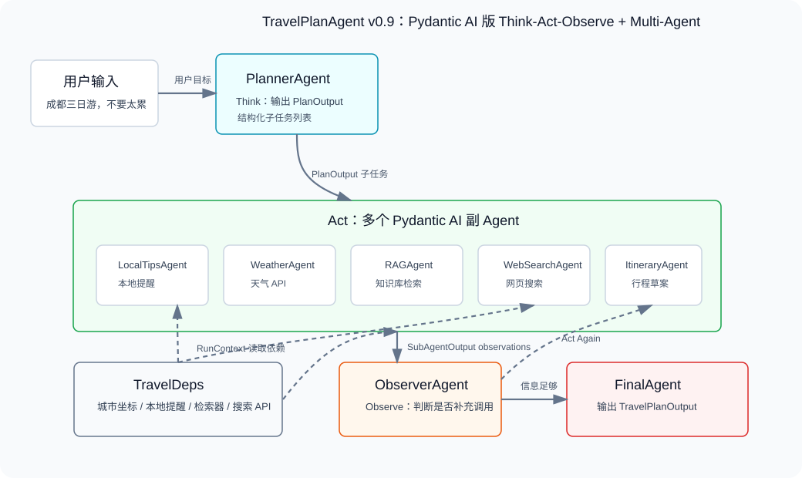

# 第11章 Agent 框架与工具链：用 Pydantic AI 重构 TravelPlanAgent

## 对 TravelPlanAgent 来说意味着什么

到第 10 章，TravelPlanAgent 已经具备了完整旅行规划能力：

- 能维护多轮上下文；
- 能调用本地函数、天气 API 和 web_search；
- 能做旅行知识检索；
- 能把复杂任务拆成子任务；
- 能用轻量 Multi-Agent 和 Reflection 生成完整行程。

这已经像一个真正的 Agent 了。

但它还有一个越来越明显的问题：**我们手写了太多 Agent 运行时本身应该负责的代码。**

例如：

```text
手写 ToolResult
手写工具注册
手写 Prompt 约束
手写 JSON 解析
手写输出校验
手写上下文传递
手写错误降级
```

这些代码不是没有价值。前面逐章手写它们，是为了让你看清 Agent 的骨架。

但如果进入真实项目，我们通常不会永远手搓所有运行时细节。成熟框架的作用，就是把常见结构沉淀下来，让开发者把精力放回业务目标。

第 11 章会让 TravelPlanAgent 升级到 v0.9：

```text
一个基于 Pydantic AI 的 Think-Act-Observe + Multi-Agent 版本 TravelPlanAgent
```

它不会推翻前面的知识，也不是把 v0.8 简化成“单 Agent 加几个工具”。恰恰相反，v0.9 要保留 v0.8 的核心架构：主 Agent 仍然会经历 `Think → Act → Observe → Final`，仍然会调度多个副 Agent，只是这些 Agent 的输入输出、工具注册、依赖传递和结构化结果由 Pydantic AI 管理得更规范。

---

## 本章目标

读完本章，你应该能够理解：

1. 为什么 Agent 项目发展到一定阶段后需要框架。
2. LangChain、LlamaIndex、Pydantic AI 各自更擅长什么。
3. Pydantic AI 中 `Agent`、`tool`、`RunContext`、`deps_type`、`output_type` 分别解决什么问题。
4. v0.9 如何在保留 Think-Act-Observe 和 Multi-Agent 的基础上，把工具、依赖和结构化输出交给 Pydantic AI 管理。
5. 如何根据项目类型选择合适的 Agent 框架。

## 为什么需要 Agent 框架

如果只写一个简单聊天程序，框架不是必需品。

你完全可以这样做：

```text
用户输入
→ 拼 messages
→ 调用模型
→ 打印回复
```

但 Agent 项目一旦开始变复杂，就会出现几个重复问题。

### 问题一：工具越来越多

第 7 章之后，TravelPlanAgent 至少有三类工具：

| 工具 | 作用 |
| --- | --- |
| 本地函数 | 查询城市本地提醒 |
| 天气 API | 获取实时天气 |
| web_search | 搜索公开网页攻略 |

如果继续扩展，还可能增加：

- 酒店价格查询；
- 景点开放时间查询；
- 交通路线查询；
- 预算估算；
- 用户偏好记忆。

工具越多，参数说明、调用时机、返回格式和错误处理就越容易散落在代码里。

### 问题二：结构化输出越来越重要

早期我们可以让模型直接输出一段自然语言。

但 TravelPlanAgent 后面需要输出更稳定的数据：

```json
{
  "destination": "成都",
  "daily_plan": [],
  "weather_advice": "",
  "sources": []
}
```

如果每次都靠 Prompt 说“请输出 JSON”，然后再手写 `json.loads()` 和字段检查，代码会变得很啰嗦。

更麻烦的是：模型一旦少写字段、写错类型、把 Markdown 混进 JSON，程序就会出错。

### 问题三：上下文和依赖需要统一管理

工具经常需要读取外部依赖：

```text
天气工具需要城市经纬度
RAG 工具需要知识库检索器
web_search 工具需要搜索 API 地址
模型调用需要 base_url、api_key、model_name
```

如果每个函数都自己读全局变量，代码会越来越难测试，也难替换。

成熟框架通常会提供一种“依赖注入”的方式：运行 Agent 时把依赖对象传进去，工具需要时再从上下文里读取。

### 框架不是魔法，而是运行时

Agent 框架可以理解为一个运行时。

它负责把这些东西组织起来：

```text
模型
Prompt / Instructions
工具
工具参数 Schema
工具结果
结构化输出
上下文历史
错误重试
运行事件
```

我们不是因为“框架高级”才使用框架，而是因为框架能把重复结构收起来，让业务代码更清楚。

<!-- sbs-image:width=840px -->



上图里，TravelPlanAgent 不再把所有调度细节都堆在手写类里。Pydantic AI 负责规范每个 Agent 的模型、指令、工具、依赖和输出结构，我们仍然保留主流程：

```text
Think：PlannerAgent 生成结构化子任务
Act：主控类调度 LocalTipsAgent、WeatherAgent、RAGAgent、WebSearchAgent、ItineraryAgent
Observe：ObserverAgent 判断信息是否足够
Final：FinalAgent 生成 TravelPlanOutput
```

这意味着我们需要明确：

- 每个 Agent 的角色和行为边界；
- 每个副 Agent 可以调用哪些工具；
- 工具如何读取依赖；
- 最终必须返回什么结构。

## 常见 Agent 框架概览

本章重点使用 Pydantic AI，但你也应该知道另外两个常见框架：LangChain 和 LlamaIndex。

### LangChain：生态和工作流能力强

LangChain 是很多人接触 LLM 应用时最早遇到的框架之一。

它的优势在于生态很大：模型接入、工具、向量库、文档加载、输出解析、链式调用、Agent、工作流等能力都很丰富。

现在 LangChain 的 Agent 能力与 LangGraph 关系非常紧密。根据 LangChain 官方文档，`create_agent` 会构建基于 LangGraph 的图运行时，Agent 会在模型节点和工具节点之间循环，直到达到停止条件。

这意味着 LangChain / LangGraph 很适合这些场景：

- Agent 流程复杂，需要图结构表达；
- 需要持久化、流式输出、人工介入；
- 需要和 LangChain 生态里的工具、模型、向量库集成；
- 团队愿意接受较完整的框架体系。

你可以把 LangChain / LangGraph 理解为：

```text
更适合搭建复杂 Agent 工作流和生产级编排系统
```

参考：[LangChain Agents 官方文档](https://docs.langchain.com/oss/python/langchain/agents)

### LlamaIndex：数据和 RAG 能力突出

LlamaIndex 的核心气质更偏“数据框架”。

它非常擅长把外部数据接入 LLM 应用：

- 读取 PDF、Markdown、网页、Notion、Slack 等数据；
- 文档切分；
- 构建索引；
- 语义检索；
- 多数据源路由；
- RAG 问答；
- 把 Query Engine 包装成 Agent Tool。

根据 LlamaIndex 官方文档，RAG 的基本过程是：先加载和索引数据，再根据用户问题检索最相关上下文，最后把上下文和问题一起交给 LLM 生成答案。

因此，如果项目核心是“让模型读你的私有数据”，LlamaIndex 往往会很顺手。

你可以把 LlamaIndex 理解为：

```text
更适合数据密集型 RAG 应用和知识库问答系统
```

参考：[LlamaIndex RAG 官方文档](https://docs.llamaindex.ai/en/v0.10.34/use_cases/q_and_a/)

### Pydantic AI：类型安全和结构化输出清晰

Pydantic AI 是 Pydantic 团队开发的 Agent 框架。

它的设计风格很像 FastAPI：大量使用 Python 类型标注和 Pydantic 模型，让 Agent 的输入、依赖、工具参数和最终输出都更可控。

根据 Pydantic AI 官方文档，`Agent` 可以理解为一个容器，里面包括：

| 组成部分 | 作用 |
| --- | --- |
| Instructions | 给 LLM 的开发者指令 |
| Function tools / toolsets | 模型可以调用的工具 |
| Structured output type | 最终必须返回的数据结构 |
| Dependency type constraint | 运行时依赖类型 |
| LLM model | 要调用的模型 |
| Model settings | 模型参数设置 |

这和我们前面手写 TravelPlanAgent 的结构几乎一一对应。

Pydantic AI 特别适合：

- Python 项目；
- 强调类型提示和可测试性；
- 需要稳定结构化输出；
- 希望工具函数参数自动生成 Schema；
- 希望用依赖注入管理数据库、配置、检索器、API 客户端。

你可以把 Pydantic AI 理解为：

```text
更适合类型清晰、结构化输出严格、工程边界明确的 Python Agent 项目
```

参考：[Pydantic AI Agent 官方文档](https://pydantic.dev/docs/ai/core-concepts/agent/)

## Pydantic AI 的核心概念

下面我们不急着写完整代码，先把 v0.9 中会出现的几个概念讲清楚。

### Agent：把角色、模型、工具和输出结构装在一起

在 Pydantic AI 里，`Agent` 是最重要的入口。

不过 v0.9 不是只创建一个 Agent。

为了保留 v0.8 的 Multi-Agent 架构，我们会创建一组 Pydantic AI Agent：

| Pydantic AI Agent | 对应阶段 | 职责 |
| --- | --- | --- |
| `planner_agent` | Think | 判断是否需要副 Agent，并输出结构化子任务 |
| `LocalTipsAgent` | Act | 查询本地出行提醒 |
| `WeatherAgent` | Act | 调用天气 API |
| `RAGAgent` | Act | 检索旅行知识库 |
| `WebSearchAgent` | Act | 搜索公开网页攻略 |
| `ItineraryAgent` | Act | 根据观察结果生成行程草案 |
| `observer_agent` | Observe | 判断已有信息是否足够，必要时补充任务 |
| `final_agent` | Final | 汇总观察结果，生成 `TravelPlanOutput` |

每个 Agent 都像一个声明：

```text
这个 Agent 使用什么模型
这个 Agent 有什么指令
这个 Agent 可以调用哪些工具
这个 Agent 运行时需要哪些依赖
这个 Agent 最终必须输出什么结构
```

例如，Think 阶段的规划 Agent 会这样定义：

<!-- sbs-code -->

```python
planner_agent = Agent(
    model,
    output_type=PromptedOutput(PlanOutput),
    instructions="你是 TravelPlanAgent 的 Think 阶段规划 Agent。",
)
```

而一个需要工具和依赖的副 Agent 会这样定义：

<!-- sbs-code -->

```python
weather_agent = Agent(
    model,
    deps_type=TravelDeps,
    output_type=PromptedOutput(SubAgentOutput),
    instructions="你是 WeatherAgent，必须调用天气工具。",
)
```

这些参数很关键。

| 参数 | 在 TravelPlanAgent 中的意义 |
| --- | --- |
| `model` | 调用哪个 LLM，以及使用哪个 `base_url` 和 `api_key` |
| `deps_type` | 工具运行时能读取什么依赖；不是所有 Agent 都需要 |
| `output_type` | 当前 Agent 必须返回什么结构；v0.9 使用 `PromptedOutput(...)` 提高 OpenAI-compatible 模型兼容性 |
| `instructions` | 当前 Agent 的角色、边界和行为规则 |

### output_type：把最终答案变成可校验对象

前面第 4 章讲过 Structured Output。

当时我们用 Prompt 要求模型输出 JSON，再用代码解析。

Pydantic AI 的做法更直接：把最终输出类型声明出来。

<!-- sbs-code -->

```python
class TravelPlanOutput(BaseModel):
    intent: str
    destination: str
    summary: str
    daily_plan: list[DailyPlan] = Field(default_factory=list)
    weather_advice: str = ""
    local_tips: list[str] = Field(default_factory=list)
    sources: list[str] = Field(default_factory=list)
    follow_up_questions: list[str] = Field(default_factory=list)
```

这样，模型最终不是“随便写一段文本”，而是要生成符合 `TravelPlanOutput` 的结果。

根据 Pydantic AI 官方文档，`output_type` 可以使用 Pydantic model、dataclass、TypedDict 等类型；框架会保留输出类型信息，并对结果进行校验。

这里有一个真实工程里很常见的兼容问题。

Pydantic AI 默认会使用 **Tool Output** 模式来生成结构化输出。也就是说，框架会把最终输出结构包装成一个“输出工具”，并要求模型调用它。这种方式对很多模型很好用，但有些 OpenAI-compatible 模型，尤其是某些 thinking / reasoning 模式，会拒绝 `tool_choice=required` 或对象形式的 `tool_choice`。

如果你运行时看到类似错误：

```text
The tool_choice parameter does not support being set to required or object in thinking mode
```

可以改用 `PromptedOutput`：

<!-- sbs-code -->

```python
from pydantic_ai import Agent, PromptedOutput

final_agent = Agent(
    model,
    output_type=PromptedOutput(TravelPlanOutput),
    instructions="请输出符合 TravelPlanOutput 的 JSON。",
)
```

`PromptedOutput` 的思路是：把 JSON Schema 写进提示词，让模型用普通文本返回 JSON，然后再由 Pydantic AI 解析和校验。它没有默认 Tool Output 那么“强制”，但对很多 OpenAI-compatible thinking 模型更友好。

因此，本课程 v0.9 采用：

```text
PromptedOutput(PlanOutput)
PromptedOutput(SubAgentOutput)
PromptedOutput(ObservationDecision)
PromptedOutput(TravelPlanOutput)
```

这样既保留 Pydantic 校验，又减少不同模型平台在 `tool_choice` 上的兼容问题。

这对 Agent 很重要。

因为 Agent 的输出常常要继续交给程序处理，例如：

```text
前端渲染每日行程
保存用户偏好
提取来源链接
检查是否还需要追问
```

如果输出只是自然语言，这些后续处理会很脆弱。

参考：[Pydantic AI Output 官方文档](https://pydantic.dev/docs/ai/core-concepts/output/)

### tool：让普通函数变成模型可调用工具

Pydantic AI 中可以用 `@agent.tool` 注册工具。

例如本地提醒工具：

<!-- sbs-code -->

```python
@agent.tool
def get_local_tips(ctx: RunContext[TravelDeps], city: str) -> str:
    """查询本地旅行提醒，适合交通、预约、人流和避坑建议。"""
    city = city.strip()
    if not city:
        return "没有提供城市名，无法查询本地提醒。"
    return ctx.deps.local_tips.get(city, f"暂不支持 {city}。")
```

这里最值得注意的是两点。

第一，工具参数 `city: str` 会被框架读取，用来生成工具参数 Schema。

第二，工具可以通过 `ctx.deps` 读取运行时依赖，而不是直接依赖散落的全局变量。

这比我们手写工具描述、参数解析和工具调用循环更紧凑。

### RunContext 和 deps_type：让工具安全地拿到依赖

在 v0.8 中，很多数据都是全局变量：

```text
LOCAL_TRAVEL_TIPS
CITY_COORDINATES
TRAVEL_KNOWLEDGE
search_api_url
```

这对教学很直观，但真实项目中不够灵活。

v0.9 改成一个依赖对象：

```python
@dataclass
class TravelDeps:
    local_tips: dict[str, str]
    coordinates: dict[str, dict[str, float]]
    weather_code_map: dict[int, str]
    retriever: TravelKnowledgeRetriever
    search_api_url: str
```

工具通过 `RunContext[TravelDeps]` 访问这些依赖：

<!-- sbs-code -->

```python
def search_travel_knowledge(ctx: RunContext[TravelDeps], query: str) -> str:
    return ctx.deps.retriever.retrieve(query, top_k=2)
```

这样做有几个好处：

- 测试时可以传入假的天气数据；
- 部署时可以换成真实数据库；
- 不同用户可以有不同依赖；
- 工具函数更容易复用；
- 代码边界更清楚。

### message_history：框架管理多轮上下文

第 6 章我们手写了 `ConversationMemory`。

在 Pydantic AI 中，运行结果可以通过 `all_messages()` 取出完整消息历史，下一轮再通过 `message_history` 传回去。


```python
result = self.final_agent.run_sync(
    user_input,
    message_history=self.message_history,
)
self.message_history = result.all_messages()
```

根据 Pydantic AI 官方文档，`Agent.run_sync()` 返回的结果对象可以访问消息历史，后续调用时把历史传给 `message_history`，就可以延续对话。

这说明框架没有消灭“上下文管理”这件事。

它只是把消息类型、工具调用记录、模型响应等细节统一管理了起来。

参考：[Pydantic AI Message History 官方文档](https://pydantic.dev/docs/ai/core-concepts/message-history/)

## Pydantic AI 调用流程动画

下面这个动画展示了 v0.9 的一次典型运行：

```sbs-iframe
src: assets/pydantic-ai-agent-demo.html
title: Pydantic AI Agent 调用流程动画
height: 620px
```

播放时可以注意三件事：

1. 用户输入先进入 `planner_agent`，完成 Think。
2. 主控类根据结构化子任务调度多个副 Agent，完成 Act。
3. `observer_agent` 检查观察结果是否足够，最终由 `final_agent` 输出 `TravelPlanOutput`。

## v0.9 项目代码结构

它保留了 v0.8 的核心能力，但用 Pydantic AI 重构实现方式。

| v0.8 手写结构 | v0.9 Pydantic AI 结构 |
| --- | --- |
| `LLMClient` | `OpenAIChatModel + OpenAIProvider` |
| `MainAgent.think()` | `planner_agent` 输出 `PlanOutput` |
| `BaseSubAgent` | 多个 Pydantic AI 副 Agent 输出 `SubAgentOutput` |
| `observe_and_decide_next()` | `observer_agent` 输出 `ObservationDecision` |
| `final_answer()` | `final_agent` 输出 `TravelPlanOutput` |
| `ToolResult` | 工具函数返回值 + `SubAgentOutput` |
| `ConversationMemory` | `message_history` |
| 手写 JSON 解析 | `output_type=PromptedOutput(...)` + Pydantic 校验 |
| 全局工具依赖 | `TravelDeps + RunContext` |


## TravelPlanAgentv0.9 的关键代码讲解

### 1. 定义结构化输出

`TravelPlanOutput` 是 v0.9 的最终输出契约。


```python
class TravelPlanOutput(BaseModel):
    intent: str = Field(description="用户意图分类，例如 weather_only、tips_only、travel_plan")
    destination: str = Field(description="目的地城市；如果没有识别到则为空字符串")
    summary: str = Field(description="给用户的简短结论")
    daily_plan: list[DailyPlan] = Field(default_factory=list, description="按天组织的行程计划")
    weather_advice: str = Field(default="", description="天气相关建议")
    local_tips: list[str] = Field(default_factory=list, description="本地出行提醒")
    sources: list[str] = Field(default_factory=list, description="使用过的信息来源")
    follow_up_questions: list[str] = Field(default_factory=list, description="仍需向用户追问的问题")
```

注意，`Field(description=...)` 不只是给人看的注释。

这些描述会帮助框架生成更明确的结构说明，让模型知道每个字段应该填什么。

### 2. 构建 OpenAI-compatible 模型

```python
def build_model(config: LLMConfig):
    return OpenAIChatModel(
        config.model_name,
        provider=OpenAIProvider(base_url=config.base_url, api_key=config.api_key),
    )
```

这一段替代了前面版本中的 `LLMClient.chat()`。

我们仍然需要理解 `base_url`、`api_key`、`model_name`，但不再需要自己封装底层 OpenAI SDK 请求。

### 3. 注册多个 Pydantic AI Agent

<!-- sbs-code -->

```python
self.planner_agent = build_planner_agent(self.model)
self.observer_agent = build_observer_agent(self.model)
self.final_agent = build_final_agent(self.model)
self.sub_agents = {
    "LocalTipsAgent": build_local_tips_agent(self.model),
    "WeatherAgent": build_weather_agent(self.model),
    "RAGAgent": build_rag_agent(self.model),
    "WebSearchAgent": build_web_search_agent(self.model),
    "ItineraryAgent": build_itinerary_agent(self.model),
}
```

这段代码说明：v0.9 不是把所有能力塞进一个超级 Agent，而是把 v0.8 的主/副 Agent 结构保留下来，只是每个 Agent 都由 Pydantic AI 管理。

它包含了很多前面章节的知识：

- 第 3 章的 Prompt：`instructions`;
- 第 4 章的结构化输出：`output_type`;
- 第 6 章的上下文：`message_history`;
- 第 7 章的工具调用：`@agent.tool`;
- 第 9 章的 RAG：`TravelKnowledgeRetriever`;
- 第 10 章的完整规划能力：Think-Act-Observe 和 Multi-Agent 协作。

### 4. 注册工具

天气工具在 v0.9 中变成普通函数：

<!-- sbs-code -->

```python
@weather_agent.tool
def get_weather(ctx: RunContext[TravelDeps], city: str) -> str:
    """调用 Open-Meteo 天气 API，查询目的地当前天气。"""
    coordinates = ctx.deps.coordinates.get(city)
    if not coordinates:
        return f"暂不支持 {city} 的天气查询。"

    # 拼接 API 请求，调用 Open-Meteo，返回天气文本
```

你会发现，工具本身并不需要知道模型怎么调用它。

工具只需要做好一件事：

```text
接收参数 → 执行动作 → 返回可读结果
```

至于“参数 Schema 怎样传给模型”“工具如何读取依赖”“工具结果怎样形成副 Agent 输出”，由 Pydantic AI 运行时处理。

### 5. 保留 Think-Act-Observe 主流程

<!-- sbs-code -->

```python
def run(self, user_input: str) -> TravelPlanOutput:
    plan = self.think(user_input)
    observations = self.act(plan.tasks, user_input, [])
    decision = self.observe(user_input, plan.tasks, observations)

    if not decision.enough_information and decision.next_tasks:
        more_observations = self.act(decision.next_tasks, user_input, observations)
        plan.tasks.extend(decision.next_tasks)
        observations.extend(more_observations)

    return self.final_answer(user_input, plan, observations, decision)
```

这里的主流程和 v0.8 是一致的，只是每一步的输出都变成了 Pydantic 模型：

| 阶段 | 方法 | 输出结构 |
| --- | --- | --- |
| Think | `think()` | `PlanOutput` |
| Act | `act()` | `list[SubAgentOutput]` |
| Observe | `observe()` | `ObservationDecision` |
| Final | `final_answer()` | `TravelPlanOutput` |

最终 `final_answer()` 返回的 `result.output` 已经是 `TravelPlanOutput` 对象。

因此我们可以继续调用：

```python
output.to_markdown()
```

把结构化对象变成适合命令行或教材展示的 Markdown。

## 和 v0.8 相比，v0.9 少写了什么

v0.8 是一个非常好的学习版本，因为它把 Agent 的内部过程写得很展开。

但 v0.9 更接近真实项目中的写法。

框架帮我们接管了这些部分：

| 原来需要手写 | Pydantic AI 负责 |
| --- | --- |
| 工具参数 Schema 描述 | 根据函数签名和 docstring 推断 |
| 工具注册表 | `@agent.tool` |
| 工具上下文传递 | `RunContext[TravelDeps]` |
| 最终 JSON 格式约束 | `output_type=PromptedOutput(TravelPlanOutput)` |
| 输出字段校验 | Pydantic 校验 |
| 多轮消息传递 | `message_history` |
| 模型 provider 封装 | `OpenAIChatModel + OpenAIProvider` |

这不是说 v0.8 没用了。

v0.8 帮你理解“框架底下发生了什么”。

v0.9 帮你理解“真实项目中如何把这些能力组织得更稳”。

需要特别注意：v0.9 不是功能降级。

它仍然保留了：

- `Think`：由 `planner_agent` 判断是否需要副 Agent，并输出结构化子任务；
- `Act`：主控类调度 `LocalTipsAgent`、`WeatherAgent`、`RAGAgent`、`WebSearchAgent`、`ItineraryAgent`；
- `Observe`：由 `observer_agent` 检查信息是否足够，并决定是否补充调用；
- `Multi-Agent`：不同副 Agent 拥有不同职责、不同指令和不同工具；
- `Structured Output`：所有关键阶段都使用 Pydantic 模型约束输出。

## 运行效果示例

当用户输入：

```text
我想去成都玩三天，想看熊猫、吃美食，行程不要太累。
```

Agent 可能会：

```text
1. Think：planner_agent 拆出 RAGAgent、LocalTipsAgent、ItineraryAgent 等子任务；
2. Act：RAGAgent 检索成都慢旅行知识，LocalTipsAgent 获取本地提醒；
3. Observe：observer_agent 判断是否还需要天气或公开网页资料；
4. Act Again：如果缺信息，继续调度 WeatherAgent 或 WebSearchAgent；
5. Final：final_agent 生成 TravelPlanOutput，再转成 Markdown 展示。
```

最终输出会接近：

```text
## 成都三日游可以按“熊猫 + 美食 + 慢节奏”安排

目的地：成都

### 行程安排
- Day 1｜城市慢逛与川味初体验
  - 上午：抵达后入住，适应节奏
  - 下午：人民公园、宽窄巷子
  - 晚上：火锅或串串

- Day 2｜熊猫基地与老成都文化
  - 上午：大熊猫繁育研究基地
  - 下午：武侯祠
  - 晚上：锦里或太古里
```

请注意：具体内容会随着模型、工具结果和用户输入变化。

这也是 Agent 的特点：我们控制结构和边界，但不把每一句话写死。

## 什么时候不需要框架

框架不是越早用越好。

如果你只是写：

```text
输入一句话 → 调用模型 → 输出一句话
```

那直接用 API 就可以了。

如果你的任务流程固定、工具很少、输出格式也不复杂，pipeline 可能更轻。

但当你遇到这些情况时，就应该认真考虑框架：

- 工具数量变多；
- 输出结构需要严格校验；
- 需要多轮上下文；
- 需要测试工具调用逻辑；
- 需要替换模型 provider；
- 需要把 Agent 接入真实业务系统。

TravelPlanAgent 到 v0.9 正好处在这个阶段。

## 三种框架汇总对比

| 框架 | 更擅长什么 | 主要优点 | 更适合的项目 | 需要注意 |
| --- | --- | --- | --- | --- |
| LangChain / LangGraph | Agent 工作流、图编排、复杂工具链、生产级流程控制 | 生态大，集成多；LangGraph 适合表达循环、分支、状态和人工介入 | 复杂业务 Agent、需要流式执行/持久化/状态机的系统 | 概念较多，初学者容易先学框架而忘了 Agent 基础 |
| LlamaIndex | RAG、数据接入、索引、检索、多数据源问答 | 文档加载、切分、索引、Query Engine 和数据连接器能力突出 | 企业知识库、文档问答、私有数据检索、数据密集型 Agent | 如果项目核心不是数据检索，可能用不到它的大部分能力 |
| Pydantic AI | 类型安全、结构化输出、工具函数、依赖注入 | 写法接近 FastAPI；Pydantic 模型天然适合输出校验；Python 类型提示清晰 | Python 工程项目、需要稳定结构化输出、需要可测试工具和依赖的 Agent | 生态规模小于 LangChain；复杂图工作流可能需要额外编排 |

可以简单记成：

```text
复杂工作流：优先看 LangChain / LangGraph
数据和 RAG：优先看 LlamaIndex
类型安全和结构化 Agent：优先看 Pydantic AI
```

## 小结

这一章我们完成了 TravelPlanAgent 的一次重要升级：

- 从手写 Agent 运行逻辑，过渡到成熟框架实现；
- 理解了 Agent 框架的价值不是“神秘能力”，而是管理重复结构；
- 认识了 LangChain、LlamaIndex、Pydantic AI 的不同侧重点；
- 使用 Pydantic AI 的 `Agent`、`@agent.tool`、`RunContext`、`deps_type` 和 `output_type` 重构 v0.9；
- 保留了 v0.8 的 Think-Act-Observe 主流程和 Multi-Agent 分工；
- 让 TravelPlanAgent 的最终输出变成可校验、可处理、可展示的 Pydantic 对象。

到这里，TravelPlanAgent 已经从一个命令行聊天程序，成长为一个具备工具、检索、任务规划和框架化结构的完整 Agent。

后面的章节会进入更高级的主题：Memory 和 Monitoring。

那时我们关注的不只是“Agent 能不能完成任务”，而是：

```text
它能不能长期记住用户偏好？
它运行得是否可靠？
出了问题能不能追踪？
上线之后能不能持续改进？
```

这也是 Agent 从课程项目走向真实系统时必须跨过的一道门。
