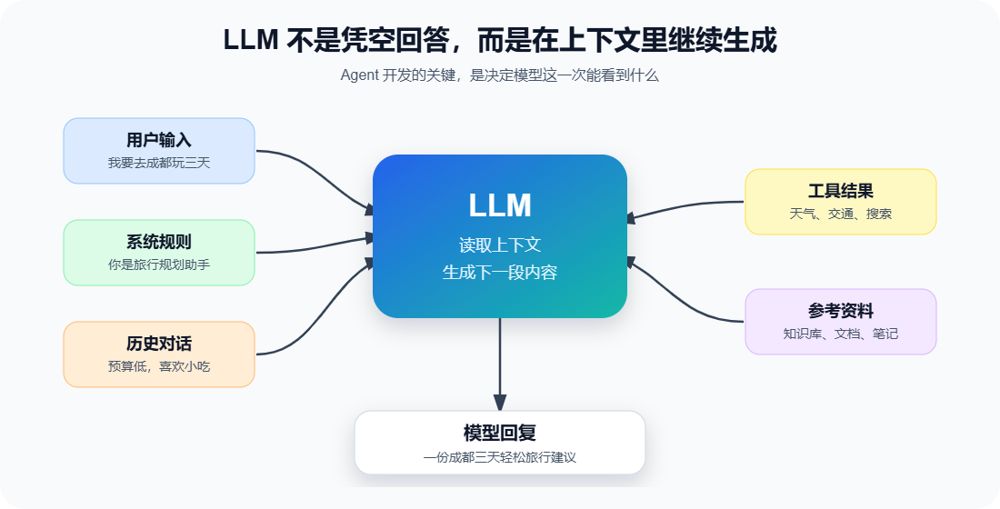

# 第1章 LLM 基础

在正式开发 Agent 之前，我们先要了解 Agent 的"大脑",也就是**大语言模型（Large Language Model，LLM）**。

你可能已经和大模型聊过天：问它一个问题，它给你一段回答；让它改一段文字，它很快给出新版本；让它写代码，它甚至能像一个结对编程伙伴一样继续往下推进。

但如果我们要开发 Agent，只会“聊天”是不够的。我们需要知道：LLM 到底在做什么？它擅长什么？不擅长什么？为什么用 LLM 编程和传统编程的感觉不一样？

这一章不追求数学推导，也不会把 Transformer 讲成论文阅读课。我们的目标很朴素：建立一个足够准确、足够好用的心智模型，让你后面写 TravelPlanAgent 时知道自己在驱动什么。

## 本章目标

读完本章，你应该能回答三个问题：

1. LLM 是什么，它为什么能生成自然语言和代码？
2. Transformer 和 Attention 大致解决了什么问题？
3. 利用 LLM 编程，与传统编程最大的思维差异在哪里？

## LLM 是什么

LLM 是 Large Language Model 的缩写，中文通常叫“大语言模型”。

一个非常实用的理解方式是：LLM 是一个根据上下文继续生成内容的模型。你给它一段输入，它会根据已经看到的内容，预测接下来最合适出现的内容。

这里的“内容”不只限于中文或英文句子，也可以是：

- Python 代码
- JSON 数据
- Markdown 文档
- SQL 查询
- 错误日志分析
- 行程规划建议
- 工具调用参数

也就是说，LLM 不是只能“说话”，它更像是一个学过大量文本模式的通用文本生成器。代码、配置、说明书、聊天记录，本质上都可以被它当成文本来处理。



上图里最关键的是“上下文”两个字。

LLM 每次生成回答时，并不是凭空思考。它会看见你这次请求中提供的内容，包括问题、历史对话、系统要求、工具结果、参考资料等，然后在这些内容的基础上继续生成。

这也是为什么同一个问题，用不同的说法问，答案可能会不一样。因为你改变的不只是“问题文本”，而是改变了模型看到的上下文。

## 它不是数据库，也不是搜索引擎

很多初学者会把 LLM 当成一个“超级知识库”。这会带来一个危险的误解：只要模型说得很自信，就以为它一定知道事实。

更准确地说：

- LLM 擅长根据语言模式组织答案。
- LLM 擅长把零散信息整理成清晰结构。
- LLM 擅长根据示例模仿格式。
- LLM 不保证自己说出的事实一定最新、一定正确。
- LLM 不能自动知道你电脑里的文件、数据库或实时天气，除非你把这些信息提供给它，或者让它调用工具获取。

这就是 Agent 后面要学习 Tool Calling 和 RAG 的原因。

如果 LLM 是大脑，那么工具、知识库、记忆、环境感知就是它连接真实世界的手、眼睛和笔记本。没有这些能力，一个模型再聪明，也只能在你给它的上下文里“想办法”。

## Token：模型看世界的基本颗粒

人读一句话时，会自然看到词语、句子和含义；LLM 处理文本时，会先把文本切分成 token。

token 可以粗略理解为“模型处理文字时的基本小片段”。它可能是一个字、一个词的一部分、一个符号，或者一小段常见字符组合。

例如这句话：

```text
帮我规划三天上海旅行
```

模型不会像人一样完整地“看见一句话”，而是会把它拆成若干 token，再逐步处理这些 token 之间的关系。

我们现在不需要深入 token 的计算细节，只要先记住两件事：

1. 输入越长，token 越多，成本和处理压力越高。
2. 模型一次能看见的 token 数量有限，这个范围叫上下文窗口。

第 6 章会专门讲 Token 与上下文机制。现在先有一个印象就够了：LLM 的“记忆”并不是无限的，我们需要主动管理它能看到什么。

## Transformer：让模型同时观察整段上下文

Transformer 是现代 LLM 背后的核心模型结构。它解决的一个重要问题是：如何让模型在生成内容时，有效理解一整段文本中不同部分之间的关系。

比如这句话：

```text
小明把护照放进背包，因为它明天出国要用。
```

这里的“它”指什么？人读起来知道大概率是“护照”，不是“背包”。模型要做类似判断，就需要在句子内部建立词语之间的关联。

Transformer 中非常重要的机制叫 Attention，中文常译为“注意力机制”。它的直觉很简单：当模型处理某个 token 时，它会判断上下文里哪些 token 更值得关注。

下面这个动画用简化方式展示了 Attention 的感觉。你可以切换当前关注词，观察它会把注意力分配给哪些上下文片段。

```sbs-iframe
src: assets/attention-flow-demo.html
title: Attention 关注关系演示
height: 420px
```

注意，这只是帮助理解的教学动画，不是模型内部真实数值的完整展示。真正的 Attention 会有更多层、更多头、更多矩阵计算。但从学习 Agent 开发的角度，我们现在需要抓住的重点是：

> LLM 生成每一小段内容时，都在参考上下文中与当前生成最相关的部分。

## LLM 为什么能写代码

代码也是语言，只是它的规则更严格。

在训练过程中，模型见过大量代码、注释、文档、错误信息、提交记录和问答内容。于是它学会了很多模式：

- 函数通常怎么定义
- API 通常怎么调用
- 报错通常意味着什么
- 一段需求通常会对应什么代码结构
- 一段测试失败通常该从哪里检查

所以，当你让 LLM 写一个函数时，它不是像传统编译器那样“推导出唯一正确答案”，而是在上下文约束下生成最可能合适的代码。

这也是为什么我们和 LLM 协作写代码时，不能只说“写个 Agent”。这句话太空了，模型会自己补很多细节，而它补出来的细节未必是你想要的。

更好的方式是逐步给清楚边界：

- 这个 Agent 的角色是什么？
- 输入是什么？
- 输出格式是什么？
- 可以调用哪些工具？
- 遇到信息不足时怎么办？
- 代码要跑在什么环境里？
- 学生需要修改哪些位置？

Prompt Engineering 的本质，就是把这些边界用模型能理解的方式表达出来。

## 利用 LLM 编程和传统编程的思维差异

传统编程里，我们习惯写下确定的指令。比如：

```text
如果分数大于等于 60，就输出“及格”；否则输出“不及格”。
```

程序会严格按照规则执行。只要输入一样，代码一样，输出就一样。

LLM 协作则更像是“给一个聪明但不总是稳定的助手分配任务”。它能理解意图，能补全细节，也能灵活表达；但它可能误解、遗漏、发散，甚至把不确定的事情说得很像真的。

| 对比项 | 传统编程 | LLM 协作编程 |
| --- | --- | --- |
| 核心方式 | 写确定规则 | 设计上下文与约束 |
| 输出特点 | 稳定、可复现 | 灵活、有概率性 |
| 擅长任务 | 精确计算、流程控制 | 文本理解、生成、总结、规划 |
| 常见问题 | 语法错误、逻辑错误 | 幻觉、跑题、格式不稳定 |
| 开发重点 | 算法和数据结构 | Prompt、上下文、工具、验证 |

做 Agent 开发时，这种差异会更加明显。

Agent 不是让 LLM “随便发挥”，而是给它一个可以行动的系统：

- 它能看到用户输入。
- 它能保存一部分上下文。
- 它能调用外部工具。
- 它能观察工具结果。
- 它能根据结果继续思考。
- 它最终给出用户需要的答案或行动方案。

这就像把一个会说话的大脑，放进一个有手、有眼睛、有工作流程的身体里。

## 对 TravelPlanAgent 来说意味着什么

本课程后面会持续开发 TravelPlanAgent。它不是一开始就很复杂，而是逐章长出能力。

一开始，它只是一个能调用 LLM 聊天的命令行程序。这个阶段我们只需要理解：如何把用户输入发送给模型，再拿到模型回复。

后来，它会逐步获得：

- 固定角色：知道自己是旅行规划助手。
- 上下文记忆：能记住前几轮对话。
- 工具调用：能查天气、查资料。
- RAG：能从旅行知识库中检索内容。
- 任务规划：能把复杂旅行需求拆成多个子任务。
- 反思检查：能检查行程是否合理。

这些能力看起来很多，但核心都建立在本章这个基础上：

> LLM 根据上下文生成内容，而 Agent 开发就是设计上下文、工具、流程和反馈，让模型更可靠地完成任务。

## 小结

这一章我们建立了 LLM 的基本心智模型：

- LLM 是根据上下文继续生成内容的模型。
- 它不是数据库，也不是搜索引擎，不能默认知道实时或私有信息。
- token 是模型处理文本的基本颗粒，上下文窗口决定模型一次能看到多少内容。
- Transformer 和 Attention 让模型能在生成时关注上下文中更相关的部分。
- 利用 LLM 编程的关键，不只是写代码，而是设计清楚任务、上下文、约束和反馈。

下一章我们会进入更具体的一层：程序到底怎样调用 LLM？也就是 API 调用原理。


