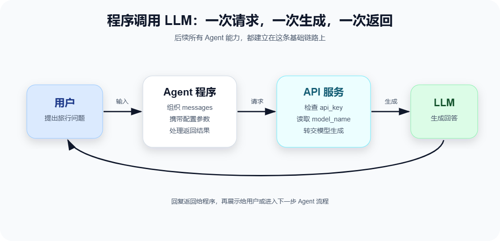

# 第2章 API 调用原理

上一章我们认识了 LLM：它会根据上下文生成内容。

现在问题来了：如果我们不是在网页聊天框里使用模型，而是在自己的程序里使用它，程序要怎么把问题发给模型？模型又怎么把回答返回给程序？

这就是 API 调用要解决的问题。

API 不是一个神秘概念。你可以先把它理解成：程序和模型服务之间约定好的“通信方式”。你的程序按照约定提交请求，模型服务按照约定返回结果。

## 本章目标

读完本章，你应该能理解：

1. 一次 LLM API 调用大致经历哪些步骤。
2. `base_url`、`api_key`、`model_name` 分别代表什么。
3. `messages` 为什么是多轮对话和 Agent 开发的核心结构。
4. `system`、`user`、`assistant` 三种 role 各自承担什么职责。

本章先不写实战代码。我们先把调用链路看明白，下一步再动手实现 TravelPlanAgent v0.1。

## 从网页聊天到程序调用

当你在网页里使用大模型时，很多细节被界面藏起来了。你只看到输入框和回答区，看不到背后的请求、鉴权、模型选择和返回数据。

当我们写 Agent 时，这些细节就必须由程序接管。



一次最基础的调用可以理解成六步：

1. 用户向我们的程序输入问题。
2. 程序把问题整理成模型 API 能理解的请求。
3. 请求带着鉴权信息发送到模型服务。
4. 模型服务根据请求选择模型并生成结果。
5. 模型服务把结果返回给程序。
6. 程序把结果展示给用户，或继续交给 Agent 流程处理。

这条链路看起来像“问一句，答一句”，但它是后续所有 Agent 能力的起点。

工具调用、RAG、多轮记忆、任务规划，本质上都是在这条链路外面继续加结构。

## 三个重点参数

LLM API 调用里有三个非常常见、也非常容易混淆的参数：

- `base_url`
- `api_key`
- `model_name`

我们可以把它们想象成寄快递时需要填写的信息。

### base_url：模型服务在哪里

`base_url` 表示模型 API 服务的地址。

如果把模型服务想象成一家店，`base_url` 就是这家店的地址。你的程序要知道请求发到哪里，才可能得到回复。

不同平台、不同部署方式，`base_url` 可能不同。例如：

```text
https://api.example.com/v1
```

在课程中，具体地址应以平台或教师提供的配置为准。学习时不需要死记某个地址，重点是理解它的作用：告诉程序去哪里请求模型服务。

### api_key：证明你有权限

`api_key` 是访问模型服务的密钥。

它的作用类似门禁卡：模型服务需要确认你有权限调用它，同时也会用它记录调用额度、费用、限流等信息。

`api_key` 必须妥善保管：

- 不要写进公开仓库。
- 不要贴到截图或课程公开文本里。
- 更推荐通过环境变量或平台配置读取。

在教材代码里，如果需要展示 `api_key`，应使用占位符：

```text
YOUR_API_KEY
```

这不是为了“麻烦”，而是为了避免学生形成把密钥直接写死在代码里的习惯。

### model_name：要调用哪个模型

`model_name` 表示这次请求要使用哪个模型。

同一个服务商可能提供多个模型。有的模型更便宜，有的更强，有的响应更快，有的上下文窗口更长。

在 Agent 开发中，选择模型不是越强越好，而是要看任务：

- 简单分类、格式整理：可以用轻量模型。
- 长文分析、复杂规划：适合更强模型。
- 需要低延迟体验：优先考虑响应速度。
- 需要处理长资料：关注上下文窗口。

课程初期应优先使用一个稳定、容易配置、适合教学的模型。等学生理解 API 调用后，再讨论模型选择的权衡。

## messages：把对话交给模型的方式

很多 LLM API 都不是只接收一个简单字符串，而是接收一个 `messages` 列表。

这个结构非常重要。因为 LLM 不是只看“当前这句话”，它要看完整上下文。`messages` 就是我们把上下文交给模型的一种标准方式。

一个简化的 `messages` 可能长这样：

```json
[
  {
    "role": "system",
    "content": "你是一个专业、耐心的旅行规划助手。"
  },
  {
    "role": "user",
    "content": "我想去杭州玩两天，有什么建议？"
  }
]
```

这段内容告诉模型两件事：

1. 你应该扮演什么角色。
2. 用户现在提出了什么需求。

如果是多轮对话，`messages` 会继续增长：

```json
[
  {
    "role": "system",
    "content": "你是一个专业、耐心的旅行规划助手。"
  },
  {
    "role": "user",
    "content": "我想去杭州玩两天，有什么建议？"
  },
  {
    "role": "assistant",
    "content": "可以重点安排西湖、灵隐寺和河坊街..."
  },
  {
    "role": "user",
    "content": "我更喜欢轻松一点，不想太赶。"
  }
]
```

模型看到这些历史内容后，就能理解“轻松一点”是在调整上一轮杭州两天行程，而不是一个完全孤立的新要求。

## role：谁在说话

`messages` 里的每条消息都有一个 `role`。常见的基础 role 有三种：

- `system`
- `user`
- `assistant`

它们不是装饰字段，而是在告诉模型“这句话从哪里来，应该如何被理解”。

```sbs-iframe
src: assets/message-roles-demo.html
title: messages 与 role 流程演示
height: 430px
```

### system：设置规则和身份

`system` 消息通常用于设定模型的角色、行为边界和输出要求。

例如：

```json
{
  "role": "system",
  "content": "你是 TravelPlanAgent，一个擅长制定旅行计划的助手。回答要清晰、具体，不要编造实时信息。"
}
```

你可以把 system 理解成“舞台说明”或“工作制度”。它不直接代表用户的问题，而是规定模型应该怎样完成任务。

在后面的 Prompt Engineering 章节，我们会大量调整 system prompt，让 TravelPlanAgent 从普通聊天机器人变得更像一个可靠助手。

### user：用户提出需求

`user` 消息就是用户真正输入的内容。

例如：

```json
{
  "role": "user",
  "content": "我下周想去成都玩三天，预算不高，喜欢吃小吃。"
}
```

在 Agent 系统中，user 消息常常是任务的起点。用户可能表达得很完整，也可能只说一句“帮我安排一下”。Agent 需要根据上下文判断是否信息足够，必要时追问或调用工具。

### assistant：模型之前的回复

`assistant` 消息记录模型之前说过什么。

多轮对话里，如果不把 assistant 的历史回复放回 `messages`，模型就不知道自己刚才说过什么，也就谈不上连续对话。

例如：

```json
{
  "role": "assistant",
  "content": "可以，我先按美食和轻松路线帮你安排。"
}
```

第 6 章讲上下文机制时，我们会进一步处理这个问题：历史消息不能无限增长，所以要设计保留策略。

## 一次请求里到底发生了什么

下面这个动画把一次 API 调用拆成几个阶段：配置参数、组织 messages、发送请求、模型生成、返回结果。

```sbs-iframe
src: assets/api-request-flow-demo.html
title: LLM API 请求流程演示
height: 430px
```

你可以把这个过程记成一句话：

> 程序用 `base_url` 找到服务，用 `api_key` 证明身份，用 `model_name` 选择模型，再把 `messages` 作为上下文交给模型生成回答。

这个句子几乎就是后面第一个 TravelPlanAgent 的核心逻辑。

## API 调用与推荐习惯

虽然本章暂时不写实战代码，但一些习惯从一开始就要建立。

### 1. 不把密钥写死在代码里

教学示例可以出现占位符，但真实运行时应从环境变量、平台配置或安全配置文件读取。


错误习惯：

```text
api_key = "sk-真实密钥..."
```

更好的习惯：

```text
api_key = 从环境变量或平台配置读取
```

### 2. 让请求结构尽量清晰

不要把所有内容揉成一个长字符串。能拆成 system、user、assistant 的，就放进 `messages`。

清晰的结构会带来两个好处：

- 模型更容易理解谁在说话。
- 后续扩展上下文、工具结果和记忆时更容易维护。

### 3. 明确模型输出边界

如果你希望模型只输出 JSON，就明确告诉它。如果你希望它给出分点建议，也要明确说明。

LLM 很聪明，但不应该让它猜规则。规则越清楚，输出越稳定。

### 4. 先跑通最小链路，再增加 Agent 能力

初学者很容易一上来就想做完整 Agent：工具、记忆、知识库、多 Agent 全部加上。

更稳的方式是：

1. 先完成一次最简单的 API 调用。
2. 再加入固定角色。
3. 再维护多轮上下文。
4. 再加入工具。
5. 再加入检索和规划。

这正是 TravelPlanAgent 的课程路线。

## 常见误区

### 误区一：只要能聊天，就等于有 Agent

能聊天只是起点，不是 Agent 的全部。

一个真正有用的 Agent 通常还需要工具、记忆、任务拆解、环境反馈和结果检查。否则它只是一个被包装过的聊天接口。

### 误区二：把所有信息都塞进 user 消息

如果角色设定、输出格式、用户需求、历史消息全都写在一个 user 字符串里，短期可能能跑，但后面会很难维护。

`messages` 的意义就在于把上下文分层。

### 误区三：忽视失败情况

API 调用可能失败，原因包括：

- 密钥错误
- 模型名称错误
- 网络问题
- 请求格式错误
- 内容过长
- 服务限流

后续写代码时，我们会逐步加入错误处理。现在先知道：调用模型不是魔法，它和调用其他网络服务一样，也会失败。

## 对 TravelPlanAgent 来说意味着什么

TravelPlanAgent v0.1 的目标非常简单：

```text
能够调用 LLM 进行简单的命令行聊天
```

为了做到这件事，我们只需要打通最基础的链路：

- 接收用户输入。
- 构造 `messages`。
- 使用 `base_url`、`api_key`、`model_name` 调用模型。
- 读取模型回复。
- 把回复展示给用户。

这个版本还不会记住多轮历史，也不会调用天气工具，更不会做复杂规划。

但它非常重要。因为后面所有能力，都是在这条 API 调用链路上继续生长出来的。

## 小结

这一章我们理解了 LLM API 调用的基本结构：

- `base_url` 决定请求发往哪里。
- `api_key` 用来证明调用权限。
- `model_name` 决定使用哪个模型。
- `messages` 承载模型能看到的上下文。
- `system`、`user`、`assistant` 让模型区分规则、用户输入和历史回复。

下一步进入实战部分时，我们会把这些概念落到代码里，实现 TravelPlanAgent v0.1：一个能通过命令行和 LLM 对话的最小 Agent。

